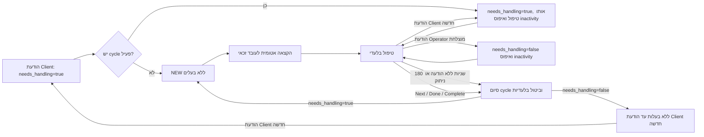
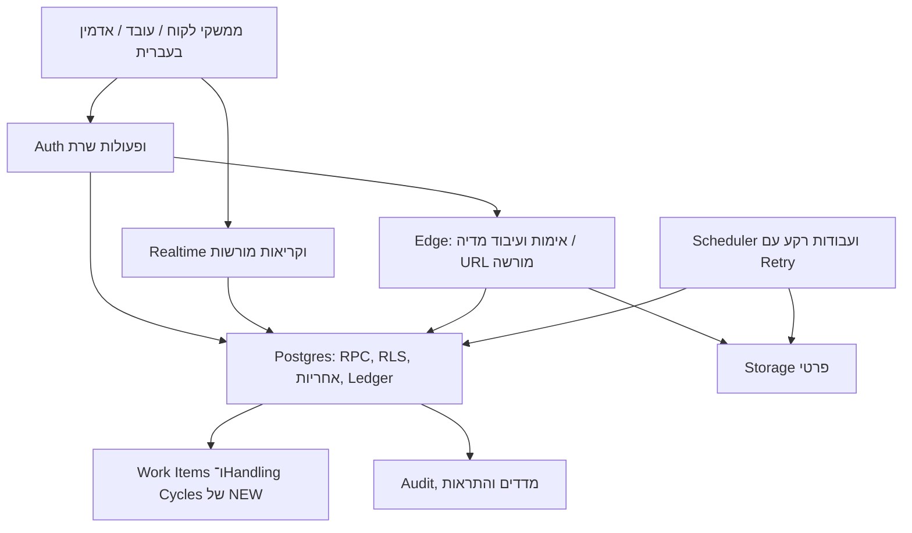
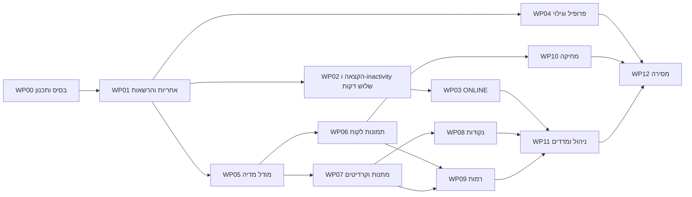

# אפיון מוצר ותוכנית עבודה — מצב קיים מול הדרישות המעודכנות

**תאריך:** 06.10.2026 · **גרסה:** 1.4 — needs_handling contract finalized · **מיועד:** בעל המוצר, ראש צוות, פיתוח, QA ותפעול.

**מעמד:** מסמך תכנון והעברה לראש צוות, המבוסס על דוח הביקורת A–Z, המשך השיחה, קובץ התשובות והקוד הנוכחי. החלטות בעל המוצר המפורטות כאן כבר נמסרו; המלצות טכניות ופרטים שטרם נקבעו מסומנים במפורש. עצם יצירת המסמך אינה ביצוע השינויים במערכת או אישור פריסה.

## תוכן עניינים

1. מטרת העבודה ומקורות האמת
2. מצב המערכת ותמונת הבסיס
3. יומן החלטות מחייבות לתכנון
4. היקף הגרסה ומסעות המשתמש
5. מפת פערים מלאה A–Z
6. אפיון מפורט לפי תחומי המוצר
7. ארכיטקטורה, הרשאות וגבולות האכיפה
8. נתונים, מיגרציות ותאימות להיסטוריה
9. תוכנית העבודה, תלויות ותוצרים
10. בדיקות קבלה ושערי שחרור
11. פרטים נקודתיים להכרעה
12. מסמכים קודמים והוראות העברה לראש צוות
13. אסמכתאות

---

## 1. מטרת העבודה ומקורות האמת

המוצר כולל לקוחות המשוחחים עם דמויות, עובדים שמפעילים את הדמויות ואדמין שמנהל את השירות. המטרה היא להשלים את המוצר הרצוי באמצעות התאמת המערכת הקיימת. לכל תחום מוגדרים המצב הנוכחי, התוצאה המבוקשת, העבודה הדרושה ובדיקת הקבלה שלה.

### 1.1 סדר קדימות

1. **החלטה מפורשת ומאוחרת של בעל המוצר בשיחה** גוברת על נוסח קודם באותו עניין.
2. **קובץ התשובות באקסל** הוא בסיס הדרישות, בהתאם לבקשת בעל המוצר להיצמד אליו; החלטות מאוחרות בשיחה מעדכנות אותו.
3. **בקשת הביקורת A–Z** משלימה תחומים שלא הוחלפו בהחלטה מאוחרת או בתשובה מפורשת באקסל.
4. **הקוד והגדרות הסביבה** מוכיחים מצב מימוש בלבד. הם אינם אישור לשנות את הדרישה כדי להתאים אותה לקוד.
5. **V2, V3, תוכנית איכות המסירה וה־Runbook** משמשים היסטוריה הנדסית ותשתית שימושית. חוזי מוצר שהוחלפו בהחלטות החדשות אינם חוסמים את התכנון החדש.

### 1.2 מקורות שנבדקו

| מזהה | מקור | שימוש במסמך |
|---|---|---|
| S1 | בקשת הביקורת המקורית בקובץ Pasted text, סעיפים A–Z | כיסוי כלל התחומים והדרישות המקוריות |
| S2 | דוח השיחה „דוח ביקורת מצב קיים מול דרישות A–Z” וכל ההודעות שאחריו | נקודת מוצא; ההחלטות המאוחרות נבדקו מול נוסחי המשתמש |
| S3 | „תשובות — אפיון ועדכון דרישות מערכת (1).xlsx”, גיליון `Form Responses 1`, שורת תשובות 2 | אפיון מפורט, זרימות ומספרים עסקיים |
| S4 | הודעת המשתמש הכוללת 12 החלטות מעודכנות | בלעדיות, שלוש דקות, מתנה מסוימת, 10%, נקודות, רמות, עברית וסליקה בהמשך |
| S5 | הבהרת המשתמש: נקודות בלבד, שבעה ימים, אישור טווחי הרמות, עובד מחובר והמשך אפיון בלבד | הכרעות המחליפות סתירות קודמות |
| S6 | הוראה מפורשת: לבטל ONLINE הנוכחי ולהמשיך עם „שיחות” בשם ONLINE | שינוי מסכי העבודה; לא אישור אוטומטי למזג יכולות פנייה יזומה |
| S7 | הקוד המקומי וקריאת הגדרות נבחרות בסביבת QA ב־06.10.2026 | ראיות למצב הקיים, כמפורט בהמשך |
| S8 | הודעת המשתמש „תשובות חד משמעית להכל” לאחר ביקורת שני קובצי V4 | ההכרעה העדכנית: שיוכים נשמרים; צפייה לעובד אחר דרך ONLINE בלבד ושליחה לבעלים; תמונת לקוח נגישה 24 שעות ו־cleanup פיזי בשלב המשך; Like יוצר Lead; פתיחה נעולה 60 שניות; המחוברים והרמות נשארים לפי הסיכום |
| S9 | החלטת המוצר הסופית על Gift commission | `gift_reward_pool = gift.credit_price * 10%` ב־Operator Points; חלוקה שווה בין Operators פעילים ומחוברים בזמן העסקה, ללא Shift ידני או תלות בשיוך/מטפל; P02 נסגר עסקית |
| S10 | החלטת בעל המוצר הסופית על handling lifecycle ועל משמעות Operator Points | cycle נשאר פעיל עד 3 דקות ללא הודעה עסקית מוצלחת של הלקוח או בעל הטיפול, או עד שחרור ידני; חוק שלוש התגובות הוא ניקוד בלבד; ל־Operator Points אין יחס המרה כספי במסמך הנוכחי |
| S11 | החלטת בעל המוצר הסופית על `needs_handling` | הודעת Client חדשה קובעת `true`; הודעת Operator עסקית ראשונה שנשמרה בהצלחה אחריה קובעת `false`; סיום cycle מחזיר ל־NEW רק כאשר הערך הקנוני הוא `true` |

**עדכון גרסה 1.4:** S8 מחליף באותם נושאים את ההכרעות הקודמות. S9 סוגר את נוסחת Gift commission ואת P02 ברמת המוצר. S10 מבטל את החוזה של „מענה ראשון סוגר cycle”, קובע inactivity מתגלגל של שלוש דקות ומסיר כל יחס המרה של Operator Points לכסף. S11 מגדיר מתי הודעת Client ממתינה למענה ומסיר את העמימות בהחלטה אם ליצור או להחזיר work item ל־NEW. שבעת הימים, ביטול השיוכים, איסור צפייה כולל וסיום טיפול במענה הראשון היו החלטות היסטוריות שכעת הוחלפו. קובצי V4 שסופקו נבדקו כהצעות; הם אינם מאומצים אוטומטית במקומות שאינם תואמים להכרעות המשתמש. תמונת הקוד/QA להלן נשארת הבדיקה המתועדת המקורית; עדכון הדרישות אינו טענה שהמימוש השתנה.

**אופן הקריאה:** „מאושר” = נמסר בהחלטות המשתמש; „בסיס דרישה” = מקור שלא הוחלף; „המלצת מימוש” = דרך מוצעת לביצוע; „פרט להכרעה” = שאלה מוגבלת שאינה מבטלת נושא שכבר אושר. ציטוטים קודמים של העוזר אינם הופכים להחלטת מוצר ללא אישור המשתמש.

---

## 2. מצב המערכת ותמונת הבסיס

### 2.1 סיכום מנהלים

קיימת מערכת משמעותית: הרשמה ותפקידים, פרופילי לקוח ודמויות, גילוי ו־Swipe, צ'אט בזמן אמת, NEW, מסכי עובדים ואדמין, ארנקים ויומן תנועות, ניקוד, סטיקרים בתשלום, מלאי מדיה, תמונות עם חלונות צפייה, דיווחים, ארכוב, אנליטיקה ותשתיות אבטחה ובדיקות. התשתית מתאימה להתפתחות הדרגתית.

**המוצר עדיין אינו מממש את מכלול הדרישות החדשות.** הפערים המרכזיים הם מודל ההרשאות והבלעדיות, הקצאה הוגנת, inactivity של שלוש דקות ו־requeue מותנה ב־`needs_handling`, שינוי ONLINE, מודל המדיה ומניעת שימוש חוזר ללקוח, העלאת תמונות לקוח ומחיקתן, Gifts ופתיחה באמצעות מתנה מסוימת, כללי קרדיטים ונקודות, רמות והשלמת מחיקה ותפעול.

השלמת V2/V3 עבור החוזים הישנים אינה הוכחה להשלמת האפיון החדש. גם קיום בדיקה בקוד אינו הוכחה שהיא הורצה על הגרסה הנוכחית. אין במסמך אחוז השלמה כולל או אומדן זמן שאינו מבוסס על פירוק ואמידה של ראש הצוות.

### 2.2 בסיס מקומי שנבדק

| נתון | מצב |
|---|---|
| תיקייה | `F:/project love/character` |
| Branch | `main` |
| HEAD | `4e9f705b8685bcc3894ed6a26de1baf03b4e6dbb` — `test: verify concurrent new claims` |
| טכנולוגיה | React, TanStack Start/Router, Vite; Supabase Auth, Postgres/RLS/RPC, Realtime, Storage ו־Edge Functions |
| מצב עבודה | היו שינויים מקומיים ו־staged עוד לפני הכנת מסמך זה; אין להניח שה־HEAD לבדו כולל אותם |
| בדיקות במסגרת הכנת המסמך | קריאת קוד, מסמכים והגדרות נבחרות בלבד; לא הורצו בדיקות אפליקציה/אינטגרציה ולא בוצעו פעולות עסקיות |

**תיקון מקומי קיים שיש לבדוק ולשלב, ולא לפתח שוב מאפס:**

- `20261005104213_enforce_active_cycle_send_responsibility.sql`
- `20261005105938_fix_claim_new_active_cycle_guard.sql`
- `20261005110244_fix_claim_guard_overload_ambiguity.sql`
- `20261005120910_revoke_active_cycle_guard_overload_access.sql`
- בדיקות `active_new_responsibility_send` והתאמות fixtures/בדיקות HTTP.

התיקון מוסיף guard לבעלות על שליחה ומתקן את האינטראקציה עם claim והרשאות overloads. הוא **אינו לבדו** משלים את מצב הצפייה בלבד ב־ONLINE, החלוקה ההוגנת, הקיבולת, inactivity של שלוש דקות או החלטת requeue לפי `needs_handling`. שינויים אלה היו קיימים לפני הכנת המסמך ולא נערכו במסגרתו.

### 2.3 מה אומת ב־QA ומה לא

נקראה סביבת Supabase `qmgkmsarzfjnqltljkjl`, שאליה מפנות הגדרות הפרויקט המקומיות שנבדקו. הקריאה הייתה של metadata, הגדרות נבחרות והגדרות פונקציות, ללא כתיבה או קריאת תוכן שיחות.

| ממצא ב־QA | משמעות |
|---|---|
| 112 רשומות migration; האחרונה `20260926232325_fix_v3_4_archived_client_scope` | ארבע מיגרציות האחריות המקומיות מ־05.10 אינן מופיעות ברשימה שנבדקה |
| `assert_operator_can_send_conversation_message` עדיין בודקת שיוך דמות ונעילה, ללא guard של בעל handling cycle | אין הוכחה שתיקון הבעלות המקומי כבר פעיל ב־QA |
| `is_conversation_operator` מבוססת על שיוך עובד לדמות | בסיס גישה שיש לשמר בהתאם ל־S8; הרשאת קריאה אינה הרשאת שליחה או בעלות טיפול |
| `concurrency_mode=lock`, `lock_timeout_minutes=1` | קיימת אכיפת נעילה בזמן שהנעילה בתוקף. אין להסיק מכאן שעובד אחר תמיד יכול לשלוח, או שהבלעדיות החדשה כבר מלאה; נעילה ובעלות טיפול הן מנגנונים שונים |
| `free_credits_on_signup=10`, `credits_enabled=true` | QA עדיין אינה בערך היעד 50; מחיר טקסט בקוד השליחה שנבדק הוא 1 |
| `mandatory_onboarding_enabled=false`, `stickers_enabled=true`, `locked_images_enabled=false` | קיום קוד אינו מעיד שהיכולת מופעלת; יש לכלול flags בבדיקות ובתוכנית הפריסה |
| `conversation_waiting_sla_minutes=1` | זהו setting קיים; אין לזהותו אוטומטית עם ספי NEW או עם יעד השירות החדש |
| פונקציית החזרת עבודה בודקת heartbeat, עם ברירת מחדל 5 דקות | אין בה שעון עסקי עצמאי של 180 שניות inactivity או החלטת requeue לפי `needs_handling` |

Auth configuration המלא, פריסות Edge, פעילות כל jobs, תאימות כל הסכמה והגדרות Production **לא אומתו מחדש** בבדיקה זו. ה־Runbook מתעד Production נדחית; מסמך זה אינו אישור שהמערכת מוכנה או נפרסה לייצור.

---

## 3. יומן החלטות מחייבות לתכנון

| מזהה | החלטה לתכנון | מקור / מה היא מחליפה |
|---|---|---|
| D01 | שלושה תפקידים: לקוח, עובד ואדמין; אין צורך במודל תפקידים חדש | S1-A, S3; שימור הבסיס |
| D02 | מודל שיוך העובדים לדמויות נשמר כפי שהוא כיום, כולל כמה עובדים לדמות. חלוקה רק לעובדים זכאים ומחוברים המשויכים לדמות | S8; מחליף את הכיוון הקודם לביטול השיוך |
| D03 | בזמן טיפול פעיל רק בעל הטיפול רשאי לשלוח. עובד אחר שמורשה לפי השיוך יכול לצפות בשיחה במצב קריאה בלבד דרך ONLINE/„שיחות”; היא אינה מוצגת לו כעבודה שלו ב־NEW | S8; מחליף את איסור הצפייה הכולל שב־S4 |
| D04 | אדמין רשאי לצפות; לקיחת טיפול או העברה הן פעולות מפורשות ומתועדות | ההמלצה שאושרה ב־S4; אין שליחה סמויה שעוקפת בעל טיפול |
| D05 | NEW: קדימות להמתנה ממושכת, חלוקה הוגנת, עד 5 שיחות ממתינות/בטיפול לעובד, וחסימה מקומית מסננת זכאות | S1-C, S3-DU2, GA2, S4 |
| D06 | handling cycle פעיל פג אחרי 3 דקות ללא הודעה עסקית חדשה שנשמרה בהצלחה מאת הלקוח או בעל הטיפול. כל הודעה כזו מאפסת את התפוגה לפי שעון השרת. typing, read receipt, פתיחת שיחה, heartbeat, presence, צפיית ONLINE ופעולת UI שאינה הודעה אינם מאפסים | S10; מחליף ספירה מההקצאה או מהיעדר מענה בלבד |
| D07 | `needs_handling = true` אם קיימת הודעת Client אחרונה ואין אחריה הודעת Operator עסקית מוצלחת; הודעת Client חדשה קובעת `true`, והודעת Operator עסקית ראשונה שנשמרה בהצלחה אחריה קובעת `false`. מענה אינו סוגר cycle. בסיום cycle עקב inactivity או Next/Done/Complete handling חוזרים ל־NEW רק אם `needs_handling = true`; אחרת השיחה נשארת ללא בעלים עד הודעת Client חדשה. העובד הקודם נשאר זכאי לפי הכללים הרגילים, ו־fairness רשאי רק להעדיף עובד אחר | S10–S11; מבטל את חוזה „המענה הראשון סוגר” ומגדיר קנונית את תנאי ה־requeue |
| D08 | ONLINE הישן לפנייה יזומה יבוטל כמסך; „שיחות” הקיים הוא בסיס המסך שייקרא ONLINE | S6; מחליף את דרישת S1-G למסך נוסף. העברת יכולות outreach אינה מאושרת אוטומטית |
| D09 | תמונת לקוח בצ'אט נגישה עד 24 שעות בלבד; לאחר מכן אין גישה לקובץ. cleanup שמוחק פיזית מ־Storage יפותח בשלב המשך | S8; מחליף שבעה ימים. לפני השלמת cleanup אין להצהיר שהקובץ נמחק פיזית בתום 24 שעות |
| D10 | גודל קובץ לקוח ייקבע בהתאם להמלצת המפתח ויכולת התשתית; אין דרישה לסינון תוכן אוטומטי או אישור ידני מוקדם | S4; 200MB הוזכר כאפשרות, לא כמגבלה סופית מחייבת |
| D11 | העובד בוחר בזמן השליחה מתנה מסוימת לתמונה נעולה; רק אותה מתנה פותחת רק את התמונה המשויכת | S4; מתנה יקרה יותר אינה חלופה |
| D12 | אפשר לרכוש שוב את המתנה לפתיחה נוספת ללא הגבלה במספר הרכישות; retry אינו רכישה נוספת | S4 וההמלצה שאושרה |
| D13 | בכל רכישת Gift מוצלחת: `gift_reward_pool = gift.credit_price * 10%`. ה־Pool הוא Operator Points ומתחלק שווה בין כל ה־Operators הפעילים והמחוברים בזמן השלמת העסקה | S9; מחליף שיוך תגמול מלא לעובד מטפל יחיד וסוגר את בסיס החישוב ואופן החלוקה |
| D14 | לצורך זכאות מספיק שה־Operator פעיל ומחובר בזמן השלמת העסקה, לפי presence/heartbeat אמין. לא נדרש Shift ידני, אין תלות בשיוך לדמות ואין תלות במטפל בשיחה. אותו עובד עם כמה tabs נספר פעם אחת | S5 ו־S9 |
| D15 | בממשק העובד מוצגות Operator Points בלבד. זו יתרת תגמול פנימית ונפרדת מ־Client Credits; במסמך ובמוצר הנוכחיים אין לה יחס המרה לשקלים או ערך כספי | S10; נוסחת Gift Pool ב־D13 נשארת ללא שינוי |
| D16 | רמות לקוח: 0–4, 5–24, 25–68, 69–250, 251 ומעלה; שמות סופיים בהמשך | S5 אישרה את תיקון החפיפות והטווח החסר |
| D17 | מחיקת חשבון בכיוון שאושר: ניקוי/אנונימיזציית PII, חסימת גישה וניקוי מדיה אישית; שימור מוגבל של מידע נדרש לעסקאות ולביקורת | S4 סעיף 8 ואישור חוזר ב־S5. תקופות ושדות לשימור יפורטו; הנושא כולו אינו פתוח מחדש |
| D18 | הגרסה הראשונה בעברית; סליקה אמיתית בהמשך | S4; מחליף דרישת השקה מיידית של סליקה או שתי שפות |
| D19 | Like נשמר ובנוסף יוצר Lead לעובדים המורשים ולאדמין | S8; מחליף את ההחלטה הקודמת של Like ללא Lead |
| D20 | 50 קרדיטים בהרשמה, 10 לטקסט לקוח, 10 לתמונת לקוח, מחיר מתנה משתנה; ללא תפוגת קרדיטים | S3-FD2, FF2, FG2; לא שונה בהמשך |
| D21 | מדיה יכולה להשתייך לכמה דמויות ותגיות. נכס יכול להישלח ללקוחות שונים, אך לא שוב לאותו לקוח, גם בדמות אחרת | S1-I מפורש; S3-DR2, DS2 תומכים במניעת חזרה. LG2 מנוסח ברמת דמות/שיחה ואינו מבטל במפורש את הכלל הרחב |
| D22 | נשמרים חיוב, היסטוריית שיחה, זיהוי העובד ששלח, הערות פנימיות ודיווח/חסימה מקומית | S1, S3; יש להתאים להרשאות החדשות |
| D23 | לקוח מסתיר שיחה אצלו; רק אדמין רשאי למחוק שיחה שלמה. מחיקה מנהלית אינה ביטול עסקאות או הוראה למחיקת ledger | S3-KK2; יש להוסיף יכולת אדמין זו מעבר לסגירת השיחה הקיימת |
| D24 | כל פתיחה בתשלום של תמונה נעולה מעניקה חלון של 60 שניות. רק המתנה שנקבעה פותחת, ורכישה חדשה מאפשרת חלון נוסף | S8; משך הפתיחה אינו עוד פרט עסקי פתוח ואינו משתנה לפי מתנה בגרסה הזאת |

**פרשנות זהירה:** D21 נשען על הדרישה המפורשת חוצת הדמויות; אין להפוך אותו בלי החלטה חדשה. D17 אינו היתר לשמר כל PII בטקסט חופשי לנצח, ואינו הוראה למחוק ledger ללא מדיניות. פרטי נוסחת החלוקה וזמני צפיית תמונות עובד מפורטים בסעיף 11, ולא מוצגים כחוסר החלטה בכל תחום התמונות או הכסף.

---

## 4. היקף הגרסה ומסעות המשתמש

### 4.1 גרסת היעד הנוכחית

כלולים: לקוח/עובד/אדמין, שיוכי עובדים לדמויות, הרשמה ופרופיל, גילוי ו־Leads, שיחות, NEW ו־ONLINE המבוסס על „שיחות”, בלעדיות שליחה והקצאה, תמונות לקוח עם חסימת גישה אחרי 24 שעות, מלאי מדיה, Gifts ותמונות נעולות ל־60 שניות בכל פתיחה, קרדיטים ונקודות, תגי לקוח, דיווחים וחסימות, מחיקת חשבון, ניהול ומדידה, בדיקות ומוכנות להפעלה. cleanup אוטומטי של תמונות לקוח לאחר תפוגה הוא שלב המשך מפורש ב־WP06-B.

סליקה, החזרים דרך ספק ואסמכתאות רכישה אמיתית מתוכננים כמסלול המשך. אנגלית, וידאו ויכולות עתידיות אינן חלק ממימוש הגרסה הראשונה. רמת שיחה נפרדת והטבות לרמות נשארות הרחבות מותנות בנוסחה; רמות הלקוח המאושרות כן נכללות.

### 4.2 מסע לקוח

הרשמה ואימות → אישורי שירות וגיל → השלמת פרופיל והעדפות → גילוי דמות ומועדף → שיחה רציפה עם הדמות → טקסט/תמונה/Gift וחיוב תואם → מענה בזמן אמת → פתיחת תמונה באמצעות המתנה שהוגדרה → צפייה ברמה ובהיסטוריה → דיווח/תמיכה/בקשת מחיקת חשבון.

בכל פעולה בתשלום יוצג מחיר לפני אישור. ניסיון שנכשל לא יציג הודעה כאילו נשלחה, וחוסר יתרה לא יוצר הודעה/פתיחה חלקית. אין להציג אישור „בקשת רכישה נרשמה” אם לא נשמרה בקשה בפועל.

### 4.3 מסע עובד

כניסה מאומתת וזמינות מחיבור פעיל → קבלת עבודה ב־NEW לפי שיוך לדמות → בעלות בלעדית על המענה → חילופי הודעות בשם הדמות, מדיה או Gift תוך איפוס inactivity בכל הודעה עסקית מוצלחת → סיום ב־timeout או בשחרור ידני → חזרה ל־NEW רק אם `needs_handling = true`, או המתנה ללא בעלים אם `false` → עבודה נוספת. ONLINE מציג שיחות המותרות לפי השיוך, כולל צפייה בלבד בשיחה שבטיפול עובד אחר. צפייה אינה תופסת בעלות או קיבולת; מעבר לטיפול משתמש במנגנון האחריות המשותף. העובד רואה Leads מורשים ואת הנקודות שלו, ולא נתוני ביצוע של עמיתים.

### 4.4 מסע אדמין

ניהול משתמשים ודמויות → ניהול מאגר המדיה, תגיות וקטלוג Gifts → בקרה על תור העבודה והעברות → התאמות קרדיטים/נקודות עם סיבה → טיפול בדיווחים ומחיקות → מדדי שירות ובדיקת חריגים → תיעוד פעולות רגישות. פעולה בשם דמות שומרת את זהות האדמין שביצע אותה.

### 4.5 חוזה ממשק משותף

לכל מסך ופעולה יוגדרו טעינה, מצב ריק, הצלחה, שגיאה, חוסר הרשאה, ניתוק, ניסיון חוזר, פעולה כפולה ושינוי בעלות תוך כדי עבודה. אין להציג הצלחה לפני אישור שרת. יש לשמר טיוטה שאפשר לשחזר בבטחה, אך לא לשלוח אותה אוטומטית לאחר שינוי בעלות. נדרשת בדיקת עברית/RTL, מובייל, מקלדת, מיקוד והודעות נגישות.

---

## 5. מפת פערים מלאה A–Z

**סיווגים:** שימור = בסיס מתאים; התאמה = שינוי יכולת קיימת; הוספה = חסר; ביטול = רכיב מוצר שהוחלט להסיר; מותנה/עתידי = לא חוסם את יתר הפיתוח. הקישורים E01–E20 מפורטים בסעיף 13.

| תחום | המימוש שנמצא | יעד ופעולה | שכבות / עדיפות / חבילת עבודה |
|---|---|---|---|
| A — תפקידים | Client/Operator/Admin פעילים; middleware ו־RPC | לשמר; לחדד אדמין הפועל כעובד וגבולות מידע בין עובדים | Auth/RPC/RLS/UI · קריטי · WP01 |
| B — שיוך דמויות | `character_operator_assignments` נאכף במסלולים רבים | לשמר את המודל והניהול; לבדוק אכיפה בכל מסלול ולהפריד שיוך מהרשאת שליחה בזמן טיפול | DB/RLS/Analytics/UI · קריטי · WP01 |
| C — NEW ושיחות | claim, work items, cycles, heartbeat; קריאה בשיחות לפי שיוך; תיקון שליחה מקומי | בלעדיות שליחה, `needs_handling` קנוני, requeue מותנה, קריאה לעובד מורשה אחר דרך ONLINE בלבד, חלוקה הוגנת, קיבולת 5 ו־timeout עסקי 3 דקות | DB/RPC/Realtime/UI/jobs · קריטי · WP01–03 |
| D — פרופיל | רוב שדות onboarding קיימים; flag חובה כבוי, עריכה חלקית ותמונת פרופיל אחת בממשק | להשלים פרופיל/תמונות ועריכה; לאכוף תנאי גישה גם בשרת; טיפול במשתמשים קיימים | Auth/RPC/UI/Storage · גבוה · WP04 |
| E — גילוי | Swipe, מועדפים, מיחזור, גלריה ומסנני גיל/עיר/עניין; Like אינו יוצר Lead | לשמר; להוסיף Lead מ־Like, נראות מורשית ומניעת כפילויות; להשלים מרחק, online ורשימת שיחות | DB/RPC/UI · גבוה · WP04 |
| F — צ'אט | realtime, typing, read/unread, pagination, הערות וזיהוי עובד | לשמר; הרשאות חדשות, idempotency ושליחת תמונות; להבטיח שיחה רציפה גם לאחר הסתרה | DB/RLS/UI · קריטי · WP01,04,06 |
| G — ONLINE | מסך outreach נפרד וגם „שיחות” | לבטל את המסך הישן ולשנות את שם „שיחות”; להתאים חיפוש/פעילות והרשאות; outreach מותנה בהחלטה נפרדת | Routing/UI/RPC · גבוה · WP03 |
| H — חסימה ודיווח | חסימה מקומית, דיווח והתראה לאדמין; חסומים מסוננים מהתור | לשמר; לסגור סטטוס/פתרון בדיווחי עובדים ולעדכן זכאות הקצאה | DB/RPC/UI/Audit · גבוה · WP02,11 |
| I — מלאי מדיה | נכס לדמות אחת/תגית אחת, reservation ו־sent גלובליים | מדיה מרכזית וקשרים רבים־לרבים; צריכה לפי asset+client | DB/Storage/Picker/Realtime · קריטי · WP05 |
| J — תמונה רגילה | permanent או view_once של 7 שניות | להסדיר מול מקור האקסל 60 שניות וסוגי התמונות; לא לערבב עם חלון תמונת לקוח של 24 שעות | RPC/Edge/UI · גבוה · WP05; P01 |
| K — תמונה נעולה | מחיר קרדיטים על asset, legacy unlock קבוע ו־paid_open של 7 שניות | בחירת Gift בזמן שליחה, exact match ל־attachment אחד, רכישה חוזרת וחלון של 60 שניות לפתיחה | DB/RPC/Edge/UI · קריטי · WP07 |
| L — Gifts/סטיקרים | Gifts היסטוריים הוסרו; קטלוג סטיקרים ומנגנון חיוב קיימים | לפתח Gifts על בסיס רכיבים קיימים; לא לשחזר אוטומטית טבלאות ישנות | DB/RPC/UI/Storage · גבוה · WP07 |
| M — קרדיטים | wallet/ledger קיימים; QA הרשמה 10, טקסט 1 בקוד; תמונת לקוח חסרה | 50/10/10, ללא תפוגה, מחיר Gift, retry בטוח ושימור יתרות עבר | DB/RPC/UI · קריטי · WP06–07 |
| N — נקודות | score events ורישומי תגמול ב־wallet נפרדים; כמה מודלי ייחוס; סטיקר מזכה עובד יחיד | Operator Points פנימיות בלבד, 1 לתגובה מזכה עד 3; Gift Pool של 10% מ־`credit_price`, בחלוקה שווה לפעילים ומחוברים; מניעת כפל תגמול | DB/RPC/Analytics/UI · קריטי · WP08 |
| O — רמות | לא נמצא מימוש רמות | להוסיף רמת לקוח בטווחים המאושרים, תג והודעת מעבר; רמת שיחה/הטבות עתידיות | DB/RPC/UI/Notifications · גבוה · WP09 |
| P — תשלומים | קטלוג חבילות והתאמת קרדיטים באדמין; אין ספק סליקה; בקשת רכישה היא toast בלבד | סליקה עתידית; כעת לתקן הבטחת רכישה שאינה נשמרת ולתעד הקצאה ידנית | UI/Admin; סליקה עתידית · WP07, FUT01 |
| Q — אדמין | מסכי ניהול רבים קיימים | לשמר; להתאים בעלות, קטלוג מתנות, חלוקה, רמות, דיווחים ומחיקה | UI/RPC/Audit · גבוה · WP11 |
| R — אנליטיקה | dashboard, SLA ו־snapshots; חלק מהחישוב בצד האפליקציה עם caps | מילון מדדים, זמני המתנה ללא איפוס מטעה, gift/points/levels; כסף אמיתי רק עם סליקה | DB/Analytics/UI · גבוה · WP11 |
| S — מחיקה | הסתרת שיחה; אין מחיקת שיחה מנהלית מלאה; בקשת מחיקת חשבון ידנית ו־admin PII archive ולאחריו Auth ban וניקוי avatar | מחיקת שיחה בידי אדמין לפי KK2, ובנפרד תהליך מחיקת חשבון מאומת, ניתן לחידוש, עם ניקוי PII/מדיה ושימור מוגבל | DB/Auth/Storage/jobs · קריטי · WP10–11 |
| T — תמונות לקוח | אין מסלול chat upload | upload intent, אימות קובץ, חיוב 10, הרשאות וחסימת גישה אחרי 24 שעות; מחיקת Storage בשלב המשך | UI/RPC/Edge/Storage/jobs · גבוה · WP06-A/B |
| U — שפות | עברית ו־RTL, ללא i18n מלא | לשמר עברית בגרסה הראשונה; אין צורך להוסיף אנגלית עכשיו | UI · שימור · WP12 |
| V — וידאו | pipeline הנוכחי ממוקד תמונות | לשמור אפשרות להרחבת סוג מדיה; לא לפתח וידאו כעת | מודל נתונים · עתידי · FUT02 |
| W — עבודות רקע | scheduler והתראות QA, דפוסי retry נקודתיים; אין lifecycle מלא לתמונת לקוח | jobs ל־3 דקות עם החלטת requeue לפי `needs_handling`, ולמחיקת חשבון; בהמשך cleanup לתמונות לקוח שחלפו 24 שעות. חסימת הגישה אינה תלויה ב־job; NEW הוא תור מוצר | DB/cron/Edge/ops · קריטי · WP02,06-B,10 |
| X — אבטחה | RLS/RPC/helpers/Storage פרטיים ותשתית ביקורת | להתאים את כל משטחי הגישה; לבדוק ownership, races, Grants, signed URLs ותאימות | רוחבי · קריטי · WP01–12 |
| Y — בדיקות ובריאות | Vitest, CI, pgTAP, HTTP ו־claim concurrency קיימים | להרחיב חוזים; DB/HTTP/concurrency אינם כרגע חלק מה־CI הרגיל | QA/CI/load · קריטי · WP12 |
| Z — מסמכים | V2/V3/V4 הישנים כוללים חוזים שסותרים את הדרישות החדשות | לעדכן מקורות ומצב אחרי כל שלב; מסמך זה מגדיר את כיוון התכנון החדש | Docs/ADR/Runbook · גבוה · WP00,12 |

---

## 6. אפיון מפורט לפי תחומי המוצר

### R01 — זהות, זכאות וגישה לשיחות

1. לקוח יכול לקרוא ולפעול רק בנתונים השייכים לו ובדמויות המותרות לפרסום.
2. עובד פעיל ומחובר זכאי לעבוד מול דמות שאליה הוא משויך במודל הקיים. חסימה מקומית, השעיה, מחיקת לקוח, דמות לא פעילה וקיבולת מגבילים זכאות. עצם השיוך אינו הופך אותו לבעל הטיפול.
3. בזמן handling cycle פעיל, רק בעל הטיפול רשאי לשלוח בשם הדמות מכל מסך ובכל מסלול API: טקסט, תמונה, סטיקר, Gift ותמונה נעולה. עובד אחר המורשה לפי השיוך יכול לצפות בשיחה דרך ONLINE/„שיחות” בלבד, במצב קריאה בלבד. NEW אינו מציג לו את הטיפול של האחר כעבודה זמינה או כמשימה שלו.
4. ב־ONLINE, הצופה המורשה רואה היסטוריה ועדכונים ותוכן מדיה לפי זכאות ותפוגה; composer וכל פעולת שליחה מושבתים. השרת אוכף את איסור השליחה גם בבקשה ישירה. פתיחת מסך, subscription או read receipt אינה מעבירה אחריות, מסיימת cycle או מזכה את הצופה בנקודות.
5. כשאין בעל טיפול, צפייה ב־ONLINE אינה רוכשת אותו אוטומטית. מעבר לעבודה/שליחה דורש claim אטומי לפי זכאות וקיבולת; אם עובד אחר תפס קודם, הצופה נשאר בקריאה בלבד. אין שימוש בנתיב המסך או ב־Referer כהוכחת הרשאה: קריאה נבדקת לפי תפקיד ושיוך, ושליחה לפי אלה ובעלות תקפה. ההבחנה „רק ONLINE” מגדירה את מסכי הצפייה במוצר, לא סוד שמונע מהמשתמש לקרוא ל־API מורשה.
6. אדמין רשאי לעיין בהיסטוריה לצורכי בקרה. פעולה בשם דמות מחייבת לקיחת אחריות או העברה מפורשת עם סיבה, רישום מבצע וביטול הרשאת הבעלים הקודם.
7. סיום טיפול, ניתוק או timeout מבטלים מיד את סמכות השליחה מכוח ההקצאה הישנה ומעדכנים את ה־UI. העובד הקודם יכול להמשיך לצפות דרך ONLINE אם עדיין מורשה לפי תפקיד ושיוך. הסרת שיוך, השעיה או ביטול הרשאת קריאה מפסיקים גם מסירת תוכן, Realtime וחידוש URLs; אין להסתפק בעדכון cache.

**קבלה:** AC01–AC04. מימוש נדרש ב־RLS/RPC/Realtime/Storage וב־UI, על בסיס מודל אחריות אחד.

### R02 — NEW: סדר, קיבולת ו־3 דקות

**יחידת העבודה היא שיחה שבה `needs_handling = true`**, גם אם הצטברו בה כמה הודעות Client. NEW מחזיק רק שיחות ללא בעלים שבהן הודעת ה־Client האחרונה טרם קיבלה לפחות הודעת Operator עסקית מוצלחת אחריה. לאחר claim אותו cycle מכסה את חילופי ההודעות עד timeout או שחרור ידני. אין להקצות הודעות מאותה שיחה במקביל לעובדים שונים.

**הגדרה קנונית:**

`needs_handling = latest_client_message exists AND no successful operator business message exists after that latest client message`

- הודעת Client חדשה קובעת `needs_handling = true`, גם אם ה־cycle הקיים נשאר פעיל.
- הודעת Operator עסקית ראשונה שנשמרה בהצלחה אחרי הודעת ה־Client האחרונה קובעת `needs_handling = false`. הודעות Operator נוספות משאירות `false`.
- אין צורך בהתאמה של הודעת Operator לכל הודעת Client בנפרד; די בהודעת Operator עסקית אחת אחרי הודעת ה־Client האחרונה.
- הודעת Operator עסקית כוללת כל נתיב שליחה מאושר שיוצר הודעת Operator תקפה בשיחה, כגון טקסט, מדיה, סטיקר, Gift או תמונה נעולה. פעולה שנכשלה, הודעת system, typing, read receipt, פתיחת מסך, צפייה, presence, heartbeat או ONLINE אינם משנים את הערך.
- ההגדרה הלוגית היא מקור האמת. הצוות רשאי לגזור אותה מהודעות, לשמור state של work item או materialized field, בתנאי שקיים מקור קנוני יחיד ואין boolean ושאילתה נגזרת שעלולים לסתור זה את זה.
- סדר Client/Operator נקבע בשרת בתוך transaction/locking מתאים. אין להכריע לפי שעון הדפדפן; אם timestamps לבדם אינם מייצרים סדר מלא, נדרש מזהה סדר יציב של השרת.

**דוגמאות מחייבות:**

1. Client ב־12:00 קובע `true`; Operator ב־12:01 קובע `false`; הודעות Operator ב־12:02 וב־12:03 משאירות `false`. סיום cycle לאחר מכן אינו מחזיר ל־NEW.
2. Client ב־12:00 קובע `true`; Operator ב־12:01 קובע `false`; Client ב־12:02 קובע שוב `true`. timeout לפני תגובת Operator מחזיר ל־NEW; תגובת Operator ב־12:03 קובעת `false` ומונעת requeue אם ה־cycle נסגר לאחר מכן ללא הודעת Client חדשה.
3. כמה הודעות Client ברצף משאירות `true`. הודעת Operator עסקית אחת אחרי האחרונה קובעת `false`; אין דרישה למספר תגובות זהה למספר הודעות ה־Client.

| אירוע | התנהגות מבוקשת |
|---|---|
| הודעת Client ללא טיפול פעיל | `needs_handling = true`; נוצרת/מתעדכנת יחידת עבודה אחת ב־NEW, ללא טיפול כפול |
| יצירת/הקצאת cycle | נוצר בעל טיפול יחיד; עוגן ה־inactivity הוא מועד ההודעה העסקית המוצלחת האחרונה בשיחה לפי שעון השרת |
| הודעת Client בזמן טיפול | `needs_handling = true`; מצטרפת לאותו cycle, אינה מגדילה capacity ומאפסת את תפוגת ה־inactivity לשלוש דקות ממועד שמירתה |
| חלוקה | לעובד פעיל, מחובר, משויך לדמות, שאינו חוסם את הלקוח ושיש לו פחות מ־5 טיפולים פעילים |
| הודעת בעל הטיפול אחרי הודעת Client האחרונה | ההודעה נשמרת, `needs_handling = false`, אירועי הניקוד נרשמים בנפרד לפי R08 ותפוגת ה־inactivity מתאפסת לשלוש דקות; ה־cycle נשאר פעיל |
| הודעת בעל הטיפול נוספת | `needs_handling` נשאר `false`; ההודעה מותרת ומאפסת inactivity. תגובה רביעית ומעלה אינה מזכה בניקוד אך אינה סוגרת או משחררת את ה־cycle |
| אירוע שאינו הודעה עסקית מוצלחת | אינו משנה `needs_handling`, אינו מאפס inactivity ואינו משפיע על scoring streak |
| 3 דקות ללא הודעה עסקית מוצלחת | ה־cycle מסתיים כ־inactivity timeout ובלעדיות השליחה מסתיימת. אם `needs_handling = true` השיחה חוזרת ל־NEW; אם `false` היא נשארת ללא בעלים עד הודעת Client חדשה |
| Next / Done / Complete handling | שחרור ידני סוגר את ה־cycle ומסיר בלעדיות מיד. אם `needs_handling = true` השיחה חוזרת ל־NEW; אם `false` היא אינה חוזרת לתור |
| ניתוק/heartbeat לא תקין | ה־cycle משתחרר בלי להמתין לפעולה ידנית; requeue נקבע באותה דרך לפי `needs_handling`. סף גילוי ניתוק הוא פרמטר טכני נפרד |
| requeue אחרי timeout/שחרור כאשר `needs_handling = true` | נשמר זמן ההמתנה. העובד הקודם נשאר זכאי אם הוא פעיל, מחובר, משויך, מתחת ל־capacity ואינו חסום; fairness רשאי להעדיף עובד אחר, ללא temporary blacklist וללא חובה לעובד אחר קודם |
| אין עובד זכאי | כאשר `needs_handling = true`, העבודה נשארת ממתינה, נשמר זמן ההמתנה ומתאפשרת התערבות אדמין |
| חסימה מקומית או השעיה בזמן טיפול | ההקצאה משתחררת באופן מתועד; רק `needs_handling = true` יוצר requeue, ואז שוב בודקים זכאות |

**המלצת אלגוריתם לראש הצוות:** בתוך התור לסדר לפי תחילת ההמתנה למענה, עם סדר יציב לשבירת שוויון. אפשר לתת משקל הוגן לעבודה שחזרה, בלי לחסום את העובד הקודם ובלי להרעיב עבודות אחרות. להקצות לעובד עם מספר הטיפולים הפעילים הנמוך ביותר; בשוויון לבחור לפי ההקצאה האחרונה/סבב הוגן. זו דרך לממש את עקרון ההוגנות, ולא נוסחה נוספת שאושרה בשיחה.

**מודל זמן ומצב מחייב:** לשמור בנפרד את מושגי `pending_since`, `assigned_at`, `last_business_message_at`, `inactivity_expires_at` והמצב הקנוני של `needs_handling`. `pending_since` מתחיל כאשר השיחה עוברת מ־`needs_handling = false` ל־`true` ומשמש לסדר התור ולמדידת ההמתנה; הודעות Client נוספות כל עוד הערך כבר `true` אינן מאפסות אותו. הודעת Operator עסקית מוצלחת אחרי הודעת ה־Client האחרונה מסיימת את חלון ההמתנה וקובעת `false`, בלי לסיים את ה־cycle. `assigned_at` הוא נתון audit של ההקצאה ואינו מקור התפוגה. בכל הודעת Client או בעל הטיפול שנשמרת בהצלחה, השרת מעדכן אטומית `last_business_message_at` ואת `inactivity_expires_at = server_timestamp + 180 seconds`, ובאותה transaction מעדכן או גוזר את `needs_handling`. אין להאריך או לשנות מצב לפי שעון דפדפן, typing, read receipt, פתיחת מסך, heartbeat, presence, הודעת system או צפיית ONLINE. הגדרת מדד השירות הכולל נשארת ב־P05.

**רצף עבודה מוצע:**

**הוראות בטיחות למימוש:**

- claim, העברה, timeout, שחרור ידני ושליחה נועלים את אותו מקור אחריות ונבדקים מול שעון השרת.
- בקשת שליחה נושאת מזהה הקצאה/גרסה; שליחה מהקצאה שפגה נדחית גם אם הדפדפן עדיין פתוח. שליחה עסקית מוצלחת של הבעלים שומרת הודעה, קובעת `needs_handling = false` אם היא אחרי הודעת ה־Client האחרונה ומעדכנת את עוגן ה־inactivity באותה עסקה לוגית.
- אין להסתמך על cron בלבד: פעולת שליחה בודקת תוקף בזמן העסקה, כדי שלא ייווצר חלון הרשאה עד ריצת הניקוי הבאה.
- תחרות בין Client, Operator ו־timeout מוכרעת פעם אחת לפי סדר שרת ונעילות: הודעת Operator שנשמרה אחרי הודעת ה־Client האחרונה קובעת `needs_handling = false`; הודעת Client מאוחרת יותר קובעת שוב `true`; הודעה תקפה שנשמרה לפני הסגירה מאפסת את התפוגה; timeout שסגר קודם גורם לבקשת השליחה הישנה להידחות. החלטת requeue קוראת את אותו מצב קנוני בתוך ה־transaction. אין שני cycles פעילים לאותה שיחה.
- צפייה בלבד ב־ONLINE אינה צורכת קיבולת. לקיחת טיפול מ־ONLINE כן צורכת את אותה קיבולת, מכבדת את השיוך וקדימות התור ואינה עוקפת בעל טיפול קיים.
- מענה ראשון אחרי הודעת Client קובע `needs_handling = false` אך אינו סוגר cycle, ותגובה נוספת אינה דורשת claim חדש כל עוד אותו cycle תקף והעובד עדיין בעליו. „שלוש תגובות מזכות” הוא כלל ניקוד נפרד בלבד: תגובות נוספות מותרות, אינן מזכות, משאירות `needs_handling = false` ומאפסות inactivity כמו כל הודעת בעלים מוצלחת.
- שחרור ידני חייב להיות RPC מפורש ואידמפוטנטי שמסיים את ה־cycle, מסיר את סמכות השליחה וקובע אטומית: `true` מחזיר work item אחד ל־NEW; `false` אינו יוצר או מחזיר work item פעיל.
- אין לחייב boolean פיזי בשם `needs_handling`. אם הוא נשמר, כל נתיבי Client/Operator/release/timeout חייבים לעדכן אותו מאותו חוזה, ונדרשת reconciliation מול סדר ההודעות כדי למנוע drift.
- requeue אינו יוצר חסימה זמנית לעובד הקודם; מנגנון fairness יכול לשנות קדימות בלבד.

### R03 — ONLINE המבוסס על מסך „שיחות”

1. להסיר את כניסת ONLINE הישנה ואת מסך ה־outreach הקיים מהניווט הפעיל.
2. לשנות את שם מסך „שיחות” הקיים ל־ONLINE, ולעדכן כותרת, ניווט, פירורי לחם וקישורים.
3. לשמור תצוגת שיחות והיסטוריה, unread, דמות ונתוני לקוח מותרים לפי השיוך. שיחה שבטיפול עובד אחר מותרת לצפייה בלבד דרך ONLINE; להציג בעלות/מצב קריאה ולהשבית פעולות שליחה בלי לבצע claim אוטומטי.
4. להשלים חיפוש לפי שם/עיר/גיל ומיון לפי פעילות, על בסיס דרישות הטופס. „ONLINE” הוא שם המסך; אינו אומר שכל שיחה בו שייכת ללקוח המחובר כרגע.
5. נוכחות לקוח חייבת לבטא פעילות אמיתית עם זמן תפוגה. `profiles.updated_at` אינו מקור אמין ל„מחובר עכשיו”. יש להגדיר גם מה משמעות דמות מחוברת ביחס לזמינות העובדים המשויכים; אין להציג נוכחות פיקטיבית.
6. היסטוריית outreach נשמרת לצורך ביקורת. ביטול המסך אינו הוראה למחוק את הטבלה או ההיסטוריה.

**המלצת routing:** `/operator/online` יהיה הכתובת הקנונית למסך המבוסס על „שיחות”; `/operator/conversations` יפנה אליו. זו בחירה טכנית מוצעת. אין לשמור בטעות את דף ה־outreach הישן תחת אותו URL.

**היקף outreach:** אין להעביר אוטומטית את כפתור „שלח פנייה”, מגבלות 24 שעות, מכסת 1+3 או ניקוד 4 נקודות אל המסך החדש. אם רוצים את היכולת בהמשך, היא חבילת משנה נפרדת עם כלל מסירה/ניקוד מאושר. בגרסה הנוכחית השליחה הרגילה בשיחה קיימת פועלת לפי R01–R02; יצירת שיחה יזומה חדשה אינה משתמעת מהחלפת השם.

### R04 — הרשמה, פרופיל, גילוי ושיחה מתמשכת

- לשמר הרשמה בדוא״ל/סיסמה ואימות; להשלים אכיפה של תנאי חשבון תקין, גיל 18+, פרופיל נדרש והסכמות לפני פעולות עסקיות. לקבוע מדיניות מעבר למשתמשים קיימים במקום נעילה פתאומית שלהם.
- פרופיל כולל שם פרטי/משפחה, תאריך לידה/גיל, עיר, תמונות, תיאור, תחומי עניין, עישון, מצב זוגי וטווחי גיל/מרחק והעדפות דמות/תוכן. שדות פרטיים אינם נחשפים לכל תפקיד מעצם היותם בטבלה.
- להרחיב את מסך עריכת הפרופיל לשדות המאושרים; להוסיף ניהול תמונות פרופיל לפי היקף מאושר. תמונת פרופיל אינה אוטומטית תמונת צ'אט בתפוגת 24 שעות.
- חישוב מרחק לפי קואורדינטות עיר, לא GPS חי. עיר ללא קואורדינטות תוצג כלא ידועה ולא תחשב מרחק אפס. להגדיר fallback ותצוגה של תוצאות ריקות.
- לשמר Swipe, favorite, מיחזור דמויות וגלריה, ללא מכסת Swipe יומית. דמויות חדשות לא יישארו מחוץ למחזור; אין דרישה לאלגוריתם המלצות חדש.
- Like נשמר בצד הלקוח ובנוסף יוצר Lead לעובדים המשויכים לדמות ולאדמין. יש לבדוק אם רשימת השיחות הקיימת כבר מציגה דמויות שסומנו; אם לא, להוסיף כניסה/כרטיס בלי להמציא הודעת לקוח או NEW.
- **המלצת מימוש Lead:** רשומה קנונית לפי לקוח ודמות עם source, זמן יצירה וסטטוס; לחיצה חוזרת/retry אינה יוצרת Lead כפול. דוח אדמין ותצוגה מורשית לעובד מציגים עניין של הלקוח. Lead אינו הרשאה לשליחה תוך עקיפת בעל טיפול, ואינו מחזיר את מסך outreach שבוטל. סטטוסים כגון חדש/טופל/נסגר והטיפול ב־Unlike/Like מחדש ייסגרו כחוזה קטן ב־WP04 לפני הפעלה; עצם יצירת ה־Lead כבר מאושרת.
- שיחה עם אותה דמות שומרת רצף גם עם החלפת עובד. הסתרה מצד לקוח אינה הוראת מחיקה לעובד ואינה סיבה לאבד היסטוריה. לצורך „שיחה אחת מתמשכת” יש להסדיר שיחה קנונית/מיפוי היסטורי; לא למזג הודעות או למחוק שיחות עבר ללא migration ייעודית.
- לשמר read/unread, typing, pagination, הפרדת תאריכים, הערות פנימיות וזיהוי המחבר לעובדים המורשים. ללקוח מוצגת הדמות, ללא נתוני העובד הפנימיים.
- אין להוסיף עריכת/מחיקת הודעות אדמין רק על סמך מטריצת הרשאות ישנה. כל שינוי בתוכן היסטורי מחייב חוזה נפרד; פעולות הסתרה/ניקוי PII מתועדות לפי מטרתן.

### R05 — מלאי מדיה ותמונות שהעובד שולח

**מודל יעד:** נכס מדיה אחד בעל זהות יציבה; קשרים לכמה דמויות, לכמה תגיות ולמאגר כללי. אדמין מנהל, עובד בוחר דרך הרחבת ה־picker הקיים. שינוי קטלוג מסתנכרן בלי להחזיר נכס שכבר נשלח לאותו לקוח לרשימת הבחירה.

**כלל שימוש:** אפשר לשלוח asset ללקוחות שונים. מסירה ראשונה ללקוח יוצרת רישום ייחודי `asset + client`, גם כשהשליחה נעשתה דרך דמות אחרת. שני עובדים/שני מסכים לא יכולים למסור אותו במקביל לאותו לקוח. רכישה חוזרת של פתיחה לאותו attachment אינה מסירה חדשה של asset ולכן מותרת.

Reservations יהיו מוגבלים בזמן ומקושרים ללקוח, לשיחה ולהקצאה. אין לסמן asset כ־`sent` גלובלי באופן שמוציא אותו מכל הלקוחות. שחרור טיפול, כשל שליחה ו־timeout משחררים reservation, אך אינם מוחקים היסטוריית מסירה שהושלמה.

תמונה רגילה ותמונה נעולה נבחרות בזמן השליחה, עם snapshot של מדיניות המסירה. תצוגה לאחר סיום זמינות תשאיר placeholder מובן; הודעת התמונה אינה נעלמת ללא הסבר. תוקף URL חתום, משך צפייה ושמירת הקובץ הם שלושה שעונים נפרדים.

**משך תמונה רגילה:** S3-EK2 מתאר 60 שניות; בקוד הנוכחי יש permanent ו־view_once של 7 שניות. בשיחה מוקדמת הוזכרה הצעה חתומה של 24 שעות, אך ההצעה עצמה לא אומתה כאן. S8 קובע בנפרד 24 שעות לתמונת לקוח ו־60 שניות לכל פתיחת תמונה נעולה; אינו מכריע מחדש את זמן התמונה הרגילה. הבסיס עבורה הוא נוסח הטופס, עם רגע תחילת ספירה והסתירה למסמך החתום מסומנים כ־P01. אין לשנות זכויות legacy אוטומטית.

### R06 — העלאת תמונת לקוח: גישה ל־24 שעות ו־cleanup בשלב המשך

**זרימה:** בחירת קובץ/צילום → upload intent בבעלות הלקוח והשיחה → העלאה לאחסון פרטי → אימות ועיבוד → finalize עם בדיקת גישה, חיוב 10 קרדיטים והודעת תמונה → הצגה למורשים → חסימת גישה בתום 24 שעות. מחיקת קבצים ונגזרות תתווסף ב־WP06-B, לפי סדר הביצוע שביקש בעל המוצר.

- חיוב והודעה נוצרים פעם אחת לאחר שהקובץ עבר אימות; retry משתמש באותו request ID. אין לחייב על העלאה שנכשלה, ואין להותיר חיוב ללא הודעה או להפך.
- אין להסתמך על סיומת: MIME אמיתי, משקל, ממדים/פיקסלים, קובץ שניתן לפענוח ובעלות על path. להסיר metadata של צילום שאינו נדרש, לרבות מיקום מוטמע.
- **המלצת פתיחה טכנית לבדיקה:** JPEG/PNG/WebP, עד 10MB לקובץ ועד 20 מיליון פיקסלים, עם הכנה/דחיסה ותצוגת שגיאה ברורה. זהו ערך מוצע ל־QA ולא טענה על יכולת ספק או אישור ל־200MB; המפתח ימדוד וישנה את המגבלה אם צריך. HEIC דורש החלטת תמיכה/המרה כדי שחוויית צילום במובייל תהיה ברורה.
- **המלצת עיגון הזמן:** 24 שעות ממועד השליחה המוצלחת בצ'אט, בשעון שרת; uploads שלא נשלחו מקבלים TTL נפרד. המקור, תצוגות מקדימות וכל הנגזרות כפופים לאותה חסימת גישה.
- **שלב A — גישה:** בזמן `expires_at` מפסיקים לאשר צפייה/URL חדש; TTL של URL שניתן קודם לא יחרוג מ־expires_at. האכיפה אינה תלויה ב־cleanup או בדפדפן פתוח. בתקופת הביניים קובץ יכול להישאר פיזית באחסון הפרטי, אך אינו נגיש דרך המוצר או קישור חתום תקף. אין להציג זאת כמחיקה שהושלמה.
- **שלב B — מחיקה פיזית בהמשך:** job מוחק מקור ונגזרות, מאמת היעלמות, מתעד כשל ומנסה שוב. יש להגדיר ולמדוד עיכוב מחיקה פיזית; אין להצהיר על שמירה פיזית של 24 שעות בלבד לפני שהמנגנון נבנה ונבדק. זהו המשך נדרש ומתועד, לא ביטול יעד המחיקה.
- אחרי תפוגה יוצג „התמונה אינה זמינה עוד”; אין לשרת מקור חלופי ציבורי. אין אפשרות להבטיח מחיקה של צילום שהנמען הוריד למכשירו.
- מחיקת תמונת לקוח אינה מוחקת asset משותף של דמות. גיבויים/עותקי תפעול נכללים במדיניות שמירה מתועדת; אין לטעון שהסרנו עותק מגיבוי אם לא קיים מנגנון לכך.
- אין דרישת moderation אוטומטי או אישור מוקדם. דיווח וחסימה וגבולות הגישה נשארים חלק מהמוצר; תנאי השימוש יגדירו זכויות שימוש ובעלות.

### R07 — Gifts, תמונות נעולות וקרדיטים

#### קטלוג וחוויית שימוש

קטלוג מתנות כולל שם, מדיה/אנימציה נתמכת, מחיר בקרדיטים, מצב פעיל וסדר הצגה. אדמין מנהל; עובד בוחר מתנה קיימת לתמונה הנעולה. בחירה אינה הרשאה לשנות מחיר קטלוג. אפשר להתבסס על רכיבי הסטיקרים הקיימים, אך יש לבחור מודל קנוני ולא להחזיק שני מנגנוני חיוב סותרים.

Gift רגיל מופיע בצ'אט ומחייב את הלקוח במחיר שהוצג ואושר. Gift שהוגדר לפתיחת תמונה נשלח בהקשר של attachment מסוים. שליחת עובד/אדמין בשם דמות אינה מחייבת את הלקוח ואינה יוצרת pool מתנה שנרכשה בידי לקוח.

#### פתיחה לפי מתנה מסוימת

1. העובד שולח asset שנבחר כנעול וקושר אליו `required_gift_id` ומדיניות מחיר/צפייה בגרסה ידועה.
2. הלקוח רואה מצב נעול, שם המתנה והמחיר, ומאשר רכישה ממוקדת לתמונה.
3. השרת בודק זהות לקוח, שיחה, attachment, התאמת Gift ID, יתרה וזכאות צפייה; מתנה אחרת נדחית גם אם מחירה גבוה יותר.
4. חיוב, הודעת Gift, רכישה, זכאות session ואירועי חלוקה נרשמים באופן עקבי ואידמפוטנטי. אם ה־URL נכשל זמנית אפשר לחדש אותו במסגרת הזכאות, ללא רכישה כפולה.
5. מתנה אחת פותחת attachment אחד בלבד, גם אם אותה מתנה מוגדרת לתמונות נוספות. Gift לא משויך אינו פותח אוטומטית את כל התמונות המתאימות בצ'אט.
6. כל פתיחה נוספת בתשלום משתמשת במזהה רכישה חדש. retry עם אותו מזהה מחזיר אותה תוצאה. מספר הרכישות אינו מוגבל; rate limit טכני למניעת כפילות/הצפה אינו משנה כלל עסקי זה.
7. כל פתיחה מעניקה **60 שניות**, בהתאם ל־D24. המלצת מימוש: להתחיל את החלון בהפעלת session המורשית הראשונה, לפי שעון שרת; retries או רענון אינם מאפסים את השעון. רכישה נוספת יוצרת זכאות/session חדשים. TTL של קישור חתום לא יחרוג מהזמן שנותר. אין להפעיל כלל זמן משתנה לפי Gift בגרסה הזאת; 7 שניות בקוד הן חוזה legacy בלבד.
8. שינוי/השבתת מתנה בקטלוג לא יבטלו בשקט זכויות בתמונות שכבר נשלחו. המלצה: snapshot של הצעה בזמן שליחת התמונה וכיבוי מתנה רק לשליחות חדשות; לקטלוג שנשלח בעבר צריך מסלול fulfillment או ביטול מפורש ומתועד.

#### קרדיטי לקוח

| פעולה | כלל יעד |
|---|---:|
| הרשמה מזכה חדשה | 50 קרדיטים פעם אחת |
| טקסט לקוח שנשלח בהצלחה | 10 קרדיטים |
| תמונת לקוח שנשלחה בהצלחה | 10 קרדיטים |
| Gift | מחיר המתנה המאושר; אין תוספת אוטומטית של 10 לקריאת Gift |
| פתיחה נוספת של תמונה | רכישה חדשה של אותה מתנה |
| יתרה לא מספקת | אין חיוב חלקי, הודעה בתשלום או פתיחה |
| תפוגה | אין תפוגת יתרה |
| שינוי אדמין | סיבה, מבצע ויומן תנועות; ללא עריכת היסטוריה קיימת |

אין להעניק מחדש 50 לכל משתמש קיים או להכפיל יתרות עבר אוטומטית. שינוי המחיר נכנס לתוקף לפי גרסת תמחור ומועד מעבר. יומן התנועות נשמר, ולכל תנועה נשמרים פעולה מקורית, מחיר והקשר.

**חבילות להמשך מסחרי לפי הטופס:** 50 = 9.90 ₪; 170 = 29.90 ₪; 230 = 49.90 ₪; 450 = 99.90 ₪; 950 = 239.90 ₪; 1500 = 339.90 ₪. לפני סליקה נדרשת הכרעה על הצגת מסים ומחיר סופי, ואין להסיק מכאן יחס קבוע בין קרדיט לשקל.

**לפני סליקה:** אפשר להשתמש בהתאמת קרדיטים מתועדת בידי אדמין. מסך החבילות הנוכחי חייב או לשמור בקשה אמיתית עם סטטוס וגורם מטפל, או להציג במפורש דרך פנייה ידנית; toast ללא רישום אינו מסלול רכישה עובד. בחירה בין שתי אפשרויות אלה היא משימת מוצר קטנה ב־WP07, לא צורך להקדים סליקה מלאה.

### R08 — נקודות עובדים וחלוקת 10%

#### הפרדה בין מדדים

- **קרדיטי לקוח:** יתרת צריכה של הלקוח.
- **ניקוד פעילות עובד:** אירועי ביצוע כגון מענה מזכה.
- **Operator Points:** יתרת תגמול פנימית ונפרדת המוצגת לעובד, הכוללת רק רכיבים שאושרו. אם ניקוד הפעילות מזכה אותה, הדבר נרשם במפורש ולא נספר פעמיים. אין לה יחס המרה לשקלים או ערך כספי במסמך הנוכחי.

#### הודעות

הבסיס מהטופס: נקודה לתגובה מזכה, עד שלוש תגובות ברצף מאז הודעת הלקוח האחרונה. תגובות 1–3 זכאיות; תגובה 4 ומעלה מותרת אך אינה מזכה. הודעת Client חדשה מאפסת את streak. הודעת Operator העסקית הראשונה אחריה קובעת `needs_handling = false`, אך שינוי זה נפרד מהניקוד ואינו תלוי בכך שהתגובה זכאית לנקודה. המימוש הקיים סופר רצף ברמת השיחה, במשותף בין עובדים. יש לשמר זאת כבסיס ולוודא שטקסט/תמונה/Gift של עובד נספרים לפי הגדרת אירוע אחידה. Admin אינו מקבל נקודות עובד אוטומטית. תגובה שנכשלה או retry אינם נספרים. כלל זה אינו מגבלת שליחה, אינו סוגר cycle, אינו משחרר בעלות ואינו קובע את timeout ה־inactivity.

כיום קיימים גם מזהים טכניים היסטוריים בשם `message_payout`, `operator_message_payout` ו־`sticker_payout`. השם `payout` במזהים אלה אינו מגדיר תשלום כספי לעובד. יש למפות כל אחד לאירוע הניקוד הפנימי שלו ולהפסיק יצירת רכיבי תגמול עתידיים שאין להם מקור בדרישה החדשה; אין למחוק היסטוריה ואין לחבר סכומים אלה באופן שמייצר כפל נקודות. חישוב אנליטיקה לא יתבסס על „מספר שורות ledger” כתחליף למספר תגובות.

#### מתנות

בכל רכישת Gift מוצלחת מחושב:

`gift_reward_pool = gift.credit_price * 10%`

`gift.credit_price` נקוב ב־Client Credits, אך תוצאת החישוב היא **Operator Points**. העובד אינו מקבל Client Credits. לדוגמה: Gift במחיר 100 Client Credits יוצר Pool של 10 Operator Points; Gift במחיר 500 Client Credits יוצר Pool של 50 Operator Points.

ה־Pool מתחלק **באופן שווה** בין כל ה־Operators הפעילים והמחוברים בזמן השלמת עסקת ה־Gift. הזכאות נקבעת ב־snapshot לפי presence/heartbeat אמין. לא נדרש Shift ידני, אין תלות בשיוך לדמות שקיבלה את ה־Gift ואין תלות במי שטיפל בשיחה. אותו Worker עם כמה tabs נספר פעם אחת בלבד.

יש לתמוך ב־decimal precision. לדוגמה: Pool של 10 נקודות עם שני עובדים מעניק 5 לכל אחד; עם ארבעה עובדים מעניק 2.5 לכל אחד. סכום כל ההקצאות חייב להיות שווה בדיוק ל־Reward Pool המקורי. אסטרטגיית precision/remainder תהיה דטרמיניסטית ומתועדת כהחלטה טכנית; אין לעגל כל הקצאה באופן שיוצר או מוחק נקודות.

retry של אותה Gift transaction אינו יוצר Pool נוסף ואינו מחלק נקודות שוב. רכישה חדשה של אותו Gift היא עסקה חדשה ולכן יוצרת Pool חדש. לכל רכישה נשמרים מחיר ה־Gift, גרסת הכלל, גודל ה־Pool, snapshot הזכאים וההקצאות. שינוי או תיקון נעשים באירוע נגדי מתועד, בלי לשכתב תנועות עבר.

אם אין אף Operator פעיל ומחובר בזמן השלמת העסקה, עסקת ה־Gift ללקוח עדיין מושלמת. נרשם `eligible_operator_count = 0`, לא נוצרות הקצאות, ולא מחלקים נקודות רטרואקטיבית לעובד שמתחבר לאחר מכן.

Client Credits ו־Operator Points הם שני ledgers ומושגים נפרדים. Operator Points נשארים יתרת תגמול פנימית ללא יחס המרה כספי במסמך הנוכחי.

### R09 — רמות ותגי לקוח

| מזהה רמה | שם זמני | מספר הודעות לקוח |
|---|---|---:|
| L1 | חדש | 0–4 |
| L2 | רמה 2 | 5–24 |
| L3 | רמה 3 | 25–68 |
| L4 | רמה 4 | 69–250 |
| L5 | לוויתן | 251 ומעלה |

הספירה היא של הודעות הלקוח, בכל השיחות שלו, ולא הודעות העובדים. **המלצת מימוש P03:** לספור כל הודעה עסקית שנשמרה בהצלחה — טקסט, תמונה או Gift — פעם אחת; פתיחת URL, read receipt ו־retry אינם הודעה. הודעת תמונה שפג תוקפה ממשיכה להיחשב כהודעה שנשלחה; היא אינה מורידה רמה.

יש להציג תג במקומות המתאימים ללקוח ולעובד/אדמין, עם label זמני שניתן לשינוי. מעבר רמה יוצר אירוע/התראה אחת. backfill של היסטוריה מחשב רמה התחלתית בלי להציף התראות ישנות. אין כרגע נוסחת רמת שיחה או הטבת קרדיטים לפי רמה; אין להמציא אותן כחלק ממימוש L1–L5.

### R10 — דיווח, חסימה, הסתרה ומחיקת חשבון

**דיווחים:** עובד יכול לדווח עם סיבה ולקשר לשיחה/מדיה. חסימה מקומית מונעת הקצאה אליו בלבד; עובדים אחרים יכולים להמשיך. אדמין מקבל התראה, מסמן בטיפול/הוכרע/נסגר ומתעד פעולה גלובלית אם נדרשת. יש להשלים workflow זה לדיווחי עובדים, שכיום מוצגים בעיקר כרשימת קריאה.

**הסתרת שיחה:** להבחין ב־UI בין הסתרה אצל לקוח, מחיקת שיחה מנהלית ומחיקת חשבון. הסתרה אישית משמרת היסטוריה מורשית ומאפשרת חידוש קשר בשיחה הקנונית.

**מחיקת שיחה בידי אדמין:** S3-KK2 מגדיר שרק אדמין רשאי למחוק שיחה שלמה. כיום קיימת סגירת שיחה, אך לא נמצא מסלול מחיקה מלאה. יש להוסיף פעולה עם סיבה, אישור מפורש ו־audit, שמסיימת טיפול פעיל, מפסיקה מסירת תוכן ומוחקת את תוכן השיחה ועותקיו התפעוליים לפי מדיניות המחיקה. אין להסתפק בשינוי `status` או בהסתרה מהאדמין. יש לשמר רק את הרשומות המינימליות הנדרשות לעסקאות, נקודות וביקורת; הפעולה אינה מבטלת עסקאות או מאפסת נקודות. תכנון המיגרציה יקבע אילו מזהי tombstone/snapshots נדרשים כדי לשמור את הקשרים בלי לשמר תוכן שנדרש למחוק.

מחיקת שיחה אינה מאפשרת לשלוח מחדש asset שכבר נשלח לאותו לקוח, ו־retry ישן לא ישחזר הודעה שנמחקה. נכסי קטלוג משותפים נשמרים; העלאות לקוח, previews ו־snippets של השיחה נכללים ב־workflow המחיקה. חידוש קשר אינו משחזר תוכן שנמחק בידי אדמין. הרשאה זו אינה אישור אוטומטי לעריכה או מחיקה של הודעות בודדות.

**מחיקת חשבון — הכיוון אושר:** בקשה מהאזור האישי → אישור דרך כתובת הדוא״ל המאומתת של החשבון → חסימת שימוש עסקי וניתוק גישה → ניקוי מזהים ו־PII → ניקוי מדיה אישית → שימור מידע מוגבל לפי מדיניות → תיעוד השלמה. האישור בדוא״ל יהיה חד־פעמי ובעל תוקף; session מחובר לבדו אינו מחליף אותו. יש לשמר את בקשת המחיקה הקיימת ולהרחיבה, ולא להציג אותה כתהליך מחיקה אוטומטי שכבר הושלם.

| סוג נתון | התנהגות יעד / החלטה משלימה |
|---|---|
| שם, פרטי קשר, פרופיל והעדפות | להסיר או לאנונימיזציה; לבדוק גם metadata ומקורות משוכפלים |
| Auth וסשנים | לבטל גישה ויכולת רענון; לטפל ב־PII ב־Auth. ban בלבד אינו הוכחת מחיקת מידע מזהה |
| תמונות פרופיל והעלאות לקוח | לנקות קבצים ונגזרות, עם pagination ו־retry; לא למחוק נכסי דמות משותפים |
| הודעות והערות פנימיות | אין שימור גורף של PII; להגדיר מה מנוקה, מה מוגבל גישה ומה נשמר לצורך מוגדר |
| ledger, חלוקות, עסקאות ותיעוד ביקורת | לשמר רק את הנדרש לפי מדיניות ותקופה מוגדרות, עם מזהה מופחת זיהוי כשאפשר |
| דיווחים ואירועי בטיחות | מדיניות גישה ושמירה מוגדרת לפי צורך הטיפול; לא פתוחים לכל עובד |
| גיבויים | לתעד תקופת שמירה ומנגנון החלת מחיקות מחדש לאחר שחזור |

פעולות DB/Auth/Storage אינן עסקה אחת. נדרש workflow עמיד לכשל עם מזהה בקשה, סטטוס לכל שלב, retries והתראה על כשל; אין להציג „הכול נמחק” כל עוד נשארו שלבים שלא בוצעו. תקופות ושדות השימור המדויקים הם P04 באחריות בעל המוצר וגורם פרטיות מתאים, ולא פתיחה מחודשת של עצם החלטת המחיקה.

### R11 — אדמין, מדדים ו־SLA

לשמר את הניהול הקיים ולהתאימו: לקוחות, עובדים, דמויות ושיוכי עובדים, פרופילים, Leads, קרדיטים, נקודות, מדיה ותגיות, מתנות, חבילות, דיווחים, שיחות ו־audit. ניהול השיוכים נשאר פעיל. אדמין רואה מקור חישוב לכל נתון כספי/נקודתי ויכול להתחקות אחר פעולה.

**מילון מדדים נדרש:**

| מדד | הגדרה לתכנון |
|---|---|
| זמן המתנה למענה | מתחיל במעבר `needs_handling` מ־`false` ל־`true` ומסתיים בהודעת Operator עסקית מוצלחת אחרי הודעת ה־Client האחרונה; הודעות Client נוספות כשהערך כבר `true` אינן מאפסות את תחילת ההמתנה |
| זמן טיפול אצל עובד | הקצאה עד inactivity timeout או שחרור ידני; מענה כשלעצמו אינו מסיים אותו |
| סיום עקב inactivity | מספר cycles שעברו 3 דקות מהודעת Client/בעלים מוצלחת אחרונה, עם עובד, מועד ועוגן הזמן |
| requeue עקב הודעה ממתינה | cycle שנסגר כאשר `needs_handling = true`; אין לספור סגירה ב־`false` כעבודה שחזרה ל־NEW |
| יעד השירות | מקור הטופס: עד 7 דקות; שעות המדידה והיחס להתראות ייקבעו ב־P05 |
| פעילות/מחובר | heartbeat או אירוע פעילות מוגדר, עם TTL; לא שינוי פרופיל |
| תגובות מזכות | אירועי תגובה ייחודיים לפי R08; לא כלל שורות ledger |
| צריכת קרדיטים/Gifts/פתיחות | עסקאות מאושרות, בניכוי ביטולים/תיקונים לפי סוג אירוע |
| הכנסה בשקלים/המרה לרכישה/החזרים | רק לאחר מקור תשלום אמיתי או רישום מסחרי אמין; אין לקרוא להקצאת קרדיטים „הכנסה” |
| רמות, שיחות ודמויות ללקוח | ספירה קנונית ללא הכפלה עקב הסתרה/שיחות היסטוריות |
| Leads | עניין שנוצר מ־Like, עם מניעת כפילות ואירועי טיפול; אינו הודעת לקוח, שיחת NEW או רכישה |
| מלאי מדיה | זמינות כללית וזמינות ללקוח מסוים הם מדדים נפרדים |
| ניקוי מדיה ומחיקה | כמות עבודות פתוחות/נכשלות וזמן מעבר לתוקף המחיקה |

יש להבדיל בין **3 דקות inactivity לסיום cycle** לבין **7 דקות יעד שירות**. ספי NEW הקיימים 5/15 דקות וה־setting הנפרד שנמצא ב־QA אינם ההחלטה החדשה. ההתראות התפעוליות יהיו לאדמין לפי דרישת הטופס; לעובד יוצגו משימות ומצבן בלי לחשוף נתוני אחרים.

דוחות עם תקרת fetch של 10,000 רשומות או 1,500 הודעות אינם בהכרח מדדים מלאים. לתכנן aggregation בצד DB, pagination וייצוא עם הרשאות, בלי לטעון שמדד חלקי מייצג את כל המוצר.

### R12 — איכות מסירה והפעלה

כלולים בתוכנית: חוזי מסכים ונתונים, בדיקות אוטומטיות לזרימות קריטיות, בדיקות הרשאות, נגישות ו־RTL, סקירת אבטחה עצמאית ממוקדת, rehearsal של מיגרציות ושחזור, ניטור והסלמה, נהלי תמיכה ונהלי עבודה לעובדים, תנאי שימוש/פרטיות מאושרים ומדדי שירות.

יש להשתמש ב־Runbook ובמערכי הבדיקות הקיימים. מסמך איכות המסירה הישן טוען שאין בדיקות ו־CI; הטענה אינה נכונה עוד. העבודה היא הרחבה וחיבור של הכיסוי הקיים, לרבות מגבלותיו, ולא התקנת תשתית מאפס.

---

## 7. ארכיטקטורה, הרשאות וגבולות האכיפה

### 7.1 מבנה מומלץ על הבסיס הקיים

הצעה: לשמר את היישום הקיים ואת Supabase. לא נדרשת כרגע החלפת framework, פיצול למיקרו־שירותים או הכנסת שירות Queue נוסף ללא צורך מדוד. עבודות מתוזמנות יכולות להשתמש במנגנונים הקיימים עם טבלת job/state ואחריות תפעולית; NEW נשאר תור העבודה העסקי לעובדים.

### 7.2 מקור אחריות יחיד

להגדיר מקור קנוני לבעל הטיפול ולמועד פקיעתו. `assigned_operator_id`, `conversation_locks` ו־handling cycles לא יכריעו כל אחד בנפרד. אפשר לשמר שדות ישנים כתאימות/תצוגה, עם sync ברור, אך לא כשלושה מקורות הרשאה סותרים.

כל RPC של שליחת הודעה/נכס מדיה משתמש באותו guard קנוני לבעלות שליחה, הנבדק גם אחרי נעילת הרשומות הרלוונטיות. קריאה והנפקת URL לצפייה משתמשות בהרשאת קריאה נפרדת: תפקיד ושיוך, גישה לשיחה, סוג הזכאות ותפוגה; אין לדרוש בעלות טיפול מצופה ONLINE שהורשה ב־D03. grant על helper פנימי אינו מתרחב לצורך פתרון תקלה ב־claim. יש לבדוק במפורש את ה־overloads שהשתנו בתיקון המקומי.

### 7.3 מטריצת הרשאות יעד

| פעולה/מידע | לקוח בעל השיחה | עובד בעל טיפול | עובד אחר בזמן טיפול | אדמין | job מורשה |
|---|---|---|---|---|---|
| תוכן שיחה והיסטוריה | כן, לפי מצב חשבון | כן | כן, לפי שיוך, בצפייה בלבד דרך ONLINE | כן, לצורכי ניהול | רק לפי צורך הפעולה |
| שליחה בשם דמות | לא | כן, בכפוף לתוקף | לא | אחרי לקיחה/העברה מתועדת | לא |
| טקסט/תמונה/Gift מצד לקוח | כן, בכפוף חיוב וגישה | לא בשם הלקוח | לא | לא מתחזה ללקוח | לא |
| הערות פנימיות/פרטי טיפול | לא | כן לפי צורך | קריאה לפי הרשאה ב־ONLINE; ללא שינוי טיפול | כן | רק אם נדרש |
| קבלת URL לתמונה בצ'אט | רק אם זכאי לצפייה | כן לפי הרשאה ותפוגה | כן לפי הרשאת קריאה ותפוגה ב־ONLINE | לפי הרשאה ומדיניות תפוגה | רק לצורך עיבוד/ניקוי |
| היתרה/הנקודות של העובד | לא | של עצמו בלבד | של עצמו בלבד | כן | רק לעסקה/חישוב מורשים |
| התאמת קרדיטים/נקודות | לא | לא | לא | עם סיבה ו־audit | רק לפי כלל עסקי מאושר |
| קטלוג/שיוכי מדיה/Gifts | תצוגה מותרת בלבד | בחירה בלבד | קטלוג כללי לפי צורך | ניהול | עיבוד מוגבל |
| חסימה מקומית ודיווח | דיווח לקוח לפי UI | כן | לפי הקשר מורשה | טיפול/פעולה גלובלית | התראות בלבד |
| העברת בעלות | לא | שחרור עצמו | לא | כן, מתועד | timeout/חלוקה לפי כלל |
| מחיקת חשבון | בקשה ואימות לעצמו | לא | לא | טיפול מורשה | שלבי workflow מוגדרים |
| מחיקת שיחה שלמה | הסתרה אישית בלבד | לא | לא | עם סיבה, אישור ו־audit | ביצוע workflow מאושר |
| Lead שנוצר מ־Like | פעולת Like של עצמו | לפי שיוך לדמות | לפי שיוך; ללא עקיפת בעלות שיחה | כן | יצירה/עדכון לפי אירוע מורשה |

שם עובד/זהות המחבר ההיסטורי הנדרשים לתפעול אינם היתר לצפות בביצועים או בשכר של אותו עובד. יש להפריד DTOs של תוכן ציבורי, לקוח פרטי, עובד ואדמין.

### 7.4 חוזי RPC ו־Realtime

- בקשות כתיבה קריטיות כוללות request ID והקשר פעולה; תגובה חוזרת מספקת אותה תוצאה בלי side effects נוספים.
- סיבות כשל מוגדרות: חוסר הרשאה, בעלות שפגה, יתרה חסרה, asset שכבר נשלח ללקוח, Gift שאינו מתאים, קובץ פסול ותמונה שפגה.
- פעולה רגישה מתבצעת בשרת; UI משקף את התוצאה, לא מחליף RLS או בדיקת בעלות.
- שינוי אחריות מחייב revalidation של יכולת השליחה ורשימת NEW. צפייה מורשית ב־ONLINE יכולה להמשיך; אין לבטל אותה רק בגלל שינוי בעל טיפול. הסרת שיוך/הרשאת קריאה מחייבת גם ביטול מסירת תוכן, subscriptions וחידוש URLs. אין לשדר תוכן ל־channel רחב ולסנן רק בדפדפן.
- `service_role` נשאר בצד שרת בלבד, עם בדיקת זהות והרשאה לפני שימוש; אין לחשוף helper פרטי כדי להקל על UI.
- URL חתום הוא יכולת גישה זמנית. יש לקצר TTL בהתאם לזכאות ולתפוגת התמונה, ולתעד את מגבלת הביטול של URL שכבר הונפק כאשר הרשאת הקריאה מוסרת. שינוי בעל טיפול לבדו אינו מבטל צפייה מורשית ב־ONLINE.

---

## 8. נתונים, מיגרציות ותאימות להיסטוריה

### 8.1 מפת שימור והסבה

| ישות קיימת | כיוון | תכנון נדרש |
|---|---|---|
| `profiles`, `client_profiles`, `user_roles`, `operators`, `auth.users` | שימור והתאמה | שערי חשבון, privacy, נוכחות ורמות; אין יצירת משתמשים מחדש |
| `characters`, `discovery_cities`, preferences/cycles | שימור והרחבה | מרחק עיר, גילוי, כניסה לשיחה ויצירת Lead בעקבות Like |
| `character_operator_assignments` | שימור | ממשיך לקבוע הרשאת דמות; לשמר ניהול, predicates ודוחות ולהוסיף בדיקות עם בעלות הטיפול |
| `conversations`, `messages`, read states, notes/customer info | שימור והתאמה | שיחה קנונית, idempotency, קריאה לפי שיוך ובעלות בלעדית לשליחה; לשמור מחבר והיסטוריה |
| work items, handling cycles, conversation locks | התאמה | בעלות קנונית, `needs_handling` או גזירה קנונית שלו, expiry, requeue, priority, capacity, assignment version ואירועי העברה |
| outreach attempts ו־RPCs ישנים | פרישה מהמוצר הפעיל | לשמר היסטוריה; להחליט אם לבטל endpoints או להגן בדגל; לא להשאיר עקיפה חשופה |
| media assets, reservations, tags, attachments | הסבה | קשרי asset–character ו־asset–tag, מסירות asset–client ושימור attachments קיימים |
| unlocks ו־open sessions | שימור תאימות והרחבה | זכויות עבר נשמרות; Gift-bound sessions חדשים בגרסת מדיניות חדשה |
| stickers/collections/message_stickers | בסיס לשימוש חוזר | הכרעה על קטלוג אחוד/מיפוי ל־Gift תוך שמירת מזהים ועסקאות |
| wallets/transactions/packages | שימור והרחבה | מחירי 50/10/10 מכאן והלאה, idempotency, snapshot ותנועות תיקון |
| score events/monthly scores | התאמה | מקור אירוע אחד ונקודות תגמול; חיבור לדוחות בלי כפל |
| blocks/reports/notifications/audit | שימור והרחבה | סטטוס טיפול, אירועי העברה/מחיקה/חלוקה, הרשאות ומניעת כפילויות |
| client conversation deletions/archive flags | התאמה | הסתרה ושיחה קנונית; workflow מחיקה נפרד מארכוב תפעולי |
| ישויות חדשות מוצעות | תוספת | Leads, נוכחות לקוחות, uploads, cleanup jobs בשלב המשך, gift purchases/allocations, level events, deletion workflow |

השמות של ישויות חדשות הם הצעת אחריות, לא SQL סופי. ראש הצוות יבחר הרחבה של טבלה קיימת במקום טבלה חדשה כאשר המשמעות זהה.

### 8.2 סדר migration מחייב כתהליך הנדסי

1. **Freeze/Baseline:** לתעד HEAD וגם staged/unstaged, manifest, מיגרציות QA, flags וגרסאות Edge. לא לבצע `migration repair` רק כדי להשוות timestamps; יש פערי שמות/זמנים היסטוריים המתועדים ב־Manifest.
2. **הוספה:** שדות/טבלאות/אינדקסים ופונקציות חדשות עם grants מצומצמים. להגדיר פעולת rollback/disable לפני הפעלה.
3. **Backfill ניתן לחידוש:** אצוות, checkpoints, reconciliation וללא איבוד היסטוריה. לא להניח שכל asset היסטורי היה ייחודי מבחינת תוכן הקובץ אם הועלה בכמה IDs.
4. **תאימות:** גרסת UI ישנה/חדשה, RPCs, Edge ו־flags חייבים להתאים. לבדוק source/QA parity לפני החלפת נתיב פעיל.
5. **בדיקות ו־cutover:** בדיקות הרשאות, עסקאות, concurrency ונתוני עבר; הפעלה מבוקרת עם ניטור.
6. **פרישה:** רק אחרי שאין קוראים ישנים והתאמות הנתונים אומתו; מחיקה פיזית של legacy אינה תנאי אוטומטי לשלב הראשון.

### 8.3 סיכוני הנתונים שיש לפתור במפורש

- **היסטוריית asset sent:** להסיק מסירות לפי attachments ולקוחות, ולא לפתוח מחדש לכולם כל asset שסומן `sent`.
- **כפילויות asset:** אותו קובץ תחת מזהים שונים דורש בדיקת נתונים ומדיניות איחוד אם רוצים למנוע גם כפילות תוכן; constraint על מזהה asset לבדו לא מגלה זאת.
- **זכויות תמונות עבר:** לא לקחת גישה קבועה ששולמה בעבר ולהחליפה אוטומטית בפתיחה זמנית; לא לחייב שוב בעקבות backfill.
- **Ledgers ונקודות:** לא למחוק ledger, לא לשנות יתרות היסטוריות ולא לערבב Client Credits עם Operator Points. לתעד נקודת מעבר לכללי התגמול החדשים.
- **שיחות היסטוריות:** הסתרה אפשרה כמה שיחות לאותו זוג; backfill של שיחה קנונית משמר מזהי הודעות וקישורים. אין migration שמוחקת את „הכפולות” ללא בחינה.
- **מחיקת שיחה מנהלית:** למפות CASCADE של הודעות/score events מול RESTRICT של attachments, paid-open sessions ו־attempts. מחיקת row של שיחה עלולה להיכשל או למחוק ראיות ניקוד; נדרש lifecycle מפורש שמשמר עסקאות/זכויות נדרשות, מנקה תוכן ו־Storage ומונע שחזור ב־retry.
- **RLS:** שיוך לדמות נשמר כתנאי גישה. יש להפריד הרשאת קריאה לעובד משויך מהיתר שליחה לבעל cycle תקף, ולמנוע מאותו predicate להעניק בטעות את שניהם.
- **מחיקה:** כשל אחרי DB ולפני Auth/Storage לא ייחשב הצלחה מלאה. תהליך retry לא מוחק מידע של לקוח אחר או מדיה משותפת.
- **רמות:** backfill יבדיל הודעות מערכת ו־retries מהודעות אמיתיות; מעבר לרמות לא מפעיל מתנות/בונוסים היסטוריים ללא החלטה.

---

## 9. תוכנית העבודה, תלויות ותוצרים

### 9.1 סדר מומלץ

הגרף מציג את התלויות העיקריות. בדיקות, מסכי שגיאה, אבטחה, מסמכי API וניטור נבנים בתוך כל חבילה; WP12 הוא אימות משולב והשלמת מסירה. אפשר לבצע פרופיל/גילוי ותכנון מדיה במקביל אחרי סגירת חוזי ההרשאות. אין צורך לחכות לכל פרטי הסליקה העתידית.

### WP00 — בסיס מוסכם וחוזי מימוש

**אחריות:** ראש צוות ובעל המוצר; סיוע DB ו־QA. **תלות:** אין.

- לשמור baseline מפורש של הקוד והסביבה; להכיר שינויים שכבר נעשו בידי אחרים.
- להפוך D01–D24 ל־decision log; למפות כל פער למשימה. לא לפתוח מחדש החלטות סגורות.
- לסגור רק את פרטי P01–P07 הנחוצים לכל חבילה לפני הפעלתה; אפשר לקדם חבילות עצמאיות בינתיים.
- להכין תרשימי מסכים קצרים ל־NEW/ONLINE, העלאה, Gift ופתיחה, נקודות, רמות ומחיקה, כולל מצבי שגיאה.
- לתכנן מטריצת RLS, חוזי RPC, סכמות חדשות ונתוני בדיקה על בסיס המסמך.

**תוצר/סיום:** backlog עם מזהי R/AC, בעלים, תלויות ואומדן של הצוות; baseline חתום מבחינת תיעוד. אין שינוי מוצר בשלב התכנון.

### WP01 — בעלות, הרשאות ושליחה מכל מסך

**אחריות:** Backend/DB עם Frontend ו־QA. **תלות:** WP00. **סיכון:** גבוה מאוד.

- לסקור את ארבע מיגרציות 05.10 והבדיקות הקיימות; לבדוק coverage של טקסט, מדיה, סטיקר, פתיחה ופעולת אדמין. להשתמש בתיקון הקיים במקום לייצר גרסה מתחרה.
- לבחור מקור אחריות אחד ולפתור תלות בנעילות הקיימות; להוסיף assignment version והתנהגות כשאין בעלים.
- לשמר אכיפת שיוך בכל הרשאות הקריאה/שליחה, profile RPCs, catalogs, media resolvers ו־analytics, ולהפריד אותה מהבעלות הבלעדית לשליחה.
- לממש צפייה בלבד לעובד משויך אחר דרך ONLINE, להסתיר את הטיפול שלו ממאגר העבודה האישי של האחר ב־NEW, ולחסום כל send RPC לבעלים אחר. לבדוק cache, קישור ישיר ו־Realtime בלי לטעון ששם המסך הוא גבול אבטחה.
- לבחור ייצוג קנוני אחד ל־`needs_handling`: חישוב אמין מסדר ההודעות, state של work item או שדה materialized. אין לחייב boolean פיזי ואין לאפשר שני מקורות אמת סותרים. כל נתיבי הטקסט, המדיה, הסטיקר, Gift והתמונה הנעולה חייבים להשתתף באותו חוזה.
- להסיר את הסגירה האוטומטית בעקבות מענה עובד מכל trigger/function פעיל; הודעת Client מוצלחת קובעת `needs_handling = true`, והודעת בעל הטיפול העסקית הראשונה אחריה קובעת `false`. שתיהן מעדכנות את עוגן ה־inactivity באותה עסקה ואינן מסיימות את ה־cycle.
- להוסיף חוזה שחרור ידני אחד ל־Next/Done/Complete handling: סגירת cycle, ביטול סמכות השליחה והחלטת requeue אטומית. `needs_handling = true` מחזיר work item יחיד ל־NEW; `false` משאיר את השיחה ללא בעלים וללא work item פעיל עד הודעת Client חדשה.
- להוסיף takeover/transfer לאדמין עם audit וללא מעקף סמוי; לוודא ש־Admin לא חייב הרשאות עובד בלתי מתועדות כדי לפעול.

**תוצר/סיום:** AC01–AC04 עוברים בשני חשבונות עובד ובבקשות ישירות, עם בדיקות grants/overloads. מצב „נעילה קיימת” אינו מספיק להכרזת סיום.

### WP02 — חלוקת NEW, capacity ו־inactivity timeout אחרי 3 דקות

**אחריות:** Backend/DB, jobs ו־QA. **תלות:** WP01.

- להוסיף חלוקה לפי שיוך, חיבור, זכאות וקיבולת עד 5; צפייה בלבד ב־ONLINE אינה נספרת כטיפול. פעולת claim ידנית אינה תחליף לדרישת החלוקה.
- לממש סדר המתנה, הוגנות ושמירת זמן ההמתנה; למנוע הרעבה ושני cycles לאותה שיחה.
- לממש expiry עסקי מתגלגל של 180 שניות מאז ההודעה העסקית המוצלחת האחרונה של Client או בעל הטיפול, עם server timestamps ועדכון אטומי בכל נתיבי השליחה. heartbeat ושאר אירועים שאינם הודעה אינם מאפסים.
- ב־timeout, שחרור ידני, ניתוק, חסימה או השבתה להחליט תחת אותה נעילה אם `needs_handling` הוא `true`; רק אז ליצור/להחזיר work item אחד ל־NEW. כאשר הוא `false`, לא להשאיר work item פעיל ולא להחזיר לתור.
- בהחזרה ל־NEW להשאיר את העובד הקודם eligible לפי אותם תנאים; fairness רשאי להעדיף עובד אחר אך לא ליצור temporary blacklist. להגדיר מצב ללא עובד חלופי ונראות לאדמין.
- להוסיף ניטור lag/כשל job ו־audit של כל הקצאה/העברה.

**תוצר/סיום:** AC05–AC07 כולל מעברי `needs_handling`, מרוץ Client/Operator/timeout, איפוס inactivity מתגלגל משני הצדדים, שחרור ידני, requeue, עומס חלוקה וקיבולת. יש הוכחה ש־cycle פג רק אחרי 180 שניות ללא הודעה עסקית מוצלחת, שאירוע שאינו הודעה אינו מאריך אותו וש־NEW מכיל work item רק כאשר `needs_handling = true` ואין בעל טיפול פעיל.

### WP03 — ONLINE החדש והסרת המסך הישן

**אחריות:** Frontend עם Backend/QA. **תלות:** חוזי WP01–02; עיצוב יכול להתחיל קודם.

- לבצע rename למסך „שיחות” והחלפת route/קישורים/ניווט; לפרוש את מסך outreach הישן.
- להתאים רשימה, חיפוש ו־unread לפי השיוך; שיחה של בעלים אחר נפתחת לקריאה בלבד. להפריד צפייה מלקיחת טיפול אטומית ומספירת capacity.
- להוסיף נוכחות אמיתית/last_seen ומיון לפי פעילות; לטפל בנתון לא ידוע ובמידע פרטי.
- לשמור היסטוריית outreach; לצמצם/לבטל את מסלול הפעולה הישן באופן שלא משאיר endpoint עוקף.

**תוצר/סיום:** AC08; שתי כניסות ישנות מובילות למוצר אחד ברור. אין מיזוג אוטומטי של quota/ניקוד outreach.

### WP04 — השלמת פרופיל, גילוי, Leads ושיחה רציפה

**אחריות:** Frontend/Backend ו־UX. **תלות:** מודל גישה WP01.

- להשלים שדות פרופיל/עריכה/תמונות והסכמות; לאכוף gate בשרת, עם rollout למשתמשים קיימים.
- להשלים distance לפי עיר והגדרת נוכחות דמות, ולשמר filters/recycling.
- להשלים את תוצאת Like ברשימת הלקוח ובנוסף Lead קנוני לצוות: schema, dedupe, נראות לאדמין ולעובדים משויכים, סטטוס ואירועי טיפול. לא ליצור הודעת לקוח/NEW או לשלוח outreach אוטומטית; לסגור את פרטי P07.
- להסדיר היסטוריית שיחה והסתרה באמצעות שיחה קנונית/מיפוי, עם backfill בטוח.

**תוצר/סיום:** AC09–AC11; אין דרך API לעקוף תנאי חשבון, אין מרחק כוזב או איבוד היסטוריה, ו־Like יוצר Lead אחד הנגיש רק למורשים.

### WP05 — שינוי מודל המדיה

**אחריות:** DB/Backend, Admin UI ו־Frontend. **תלות:** WP01; P01 לצפייה רגילה בלבד.

- להוסיף קשרי assets לדמויות ולתגיות, כלליות ומסירות לפי לקוח.
- להסב reservations ומלאי בלי לבטל זכויות עבר; למפות כפילויות/נכסים היסטוריים.
- להתאים upload/admin/picker/search/realtime וכללי deactivate/hard delete.
- להפריד משך צפייה, זמינות ו־Storage retention; לתכנן תאימות לסוגי התמונות הקיימים.

**תוצר/סיום:** AC12–AC13 ו־AC33; אותו asset מותר ללקוחות שונים ואסור למסירה שנייה לאותו לקוח, לרבות דרך דמות אחרת. חלון תמונה רגילה נאכף לפי המדיניות.

### WP06 — תמונות לקוח וחיוב 10, בשני שלבים

**אחריות:** Frontend, Edge/Storage, DB ו־QA. **תלות:** WP01, חוזי WP05/תמחור WP07; אין צורך להמתין לקטלוג Gift כדי לפתח upload.

**WP06-A — הגרסה הנוכחית:**

- לממש upload intent, validation, עיבוד ו־finalize אידמפוטנטי עם חיוב/הודעה.
- לממש הצגה, placeholders, טיפול בכשל רשת וביתרה חסרה.
- לממש חלון גישה של 24 שעות, חסימה בצד שרת ו־TTL לקישור שלא חורג מהחלון; אין תלות ב־job מחיקה לשם חסימת הגישה.
- לבדוק מגבלות קובץ על מכשירים אמיתיים ולעדכן את ברירת המחדל הטכנית; לתעד קבצים שנשארים באחסון ואת הצורך ב־cleanup.

**סיום WP06-A:** AC14, AC15 ו־AC16-A; הוכחת חסימת גישה ב־24 שעות, לרבות URL שהונפק לפני התפוגה. אין סימון „נמחק פיזית” כשלא בוצע ניקוי.

**WP06-B — המשך מתוכנן:** job מחיקה פיזית של מקור וכל הנגזרות, טיפול גם בקבצים שכבר פגו בשלב A וב־orphan uploads, retry, אימות היעלמות וניטור lag/כשלים. יש לקבוע בעלים ומועד בתוכנית ראש הצוות.

**סיום WP06-B:** AC16-B; הוכחת מחיקת Storage בפועל. שלב A יכול להימסר קודם לפי בקשת המשתמש, עם חריג השמירה הפיזית מתועד; אין להכריז שכל דרישת המחיקה הושלמה לפני B.

### WP07 — Gifts, פתיחה ממוקדת וכללי קרדיטים

**אחריות:** Backend/DB, Frontend, Admin UI ו־QA. **תלות:** WP01, WP05. חלון הפתיחה הנעולה מאושר כ־60 שניות ב־D24 ואינו ממתין ל־P01 של תמונה רגילה.

- להגדיר קטלוג Gift קנוני על בסיס הסטיקרים; להוסיף ניהול ובחירה בזמן שליחת תמונה.
- לממש exact gift + attachment, רכישה/חיוב/הודעה/session של 60 שניות/idempotency ותאימות לרכישות עבר.
- להחיל signup 50, טקסט 10 ותמונת לקוח 10 מכאן והלאה, עם flags ומדיניות יתרות עבר.
- לסגור מסלול הקצאת קרדיטים לפני סליקה ולתקן toast רכישה מטעה.
- לייצר אירוע מתנה מאושר ל־WP08; פתיחת Gifts למשתמשים תלויה גם בהשלמת חלוקת הנקודות.

**תוצר/סיום:** AC17–AC20 ו־AC33; Gift שגוי אינו פותח, retry אינו מחייב שוב ורכישה חדשה כן פותחת מחדש. חלון הצפייה נאכף בשרת. Gifts ותמונות נעולות נמסרים כזרימה מחוברת.

### WP08 — ניקוד וחלוקת מתנות

**אחריות:** Backend/DB, Analytics ו־QA. **תלות:** WP02 presence ו־WP07 אירועי רכישה. P02 סגור עסקית; הצוות מתעד את פרטי ה־precision, remainder ו־heartbeat TTL.

- למפות score, יתרת Operator Points ומזהי reward היסטוריים ולהסיר כפל עתידי; לשמר היסטוריה בלי לייחס לנקודות ערך כספי.
- לממש 1 נקודה לתגובות 1–3 מאז הודעת Client, כולל סוגי הודעות מאושרים. תגובה 4 ומעלה מותרת ואינה מזכה; הודעת Client מאפסת את ה־streak. אין לקשור את הספירה לסיום cycle, שחרור או timeout.
- לממש snapshot של Operators פעילים ומחוברים בזמן העסקה, עם dedupe של כמה tabs לאותו עובד.
- לחשב `gift.credit_price * 10%` כ־Operator Points ולחלק שווה בין כל הזכאים, ללא תלות בשיוך לדמות או בבעל הטיפול.
- לתמוך ב־decimal precision ובאסטרטגיית remainder דטרמיניסטית כך שסכום ההקצאות יהיה שווה ל־Pool המקורי.
- לאכוף idempotency: עסקה אחת מחלקת פעם אחת; רכישה חדשה יוצרת Pool חדש.
- כשאין זכאים, לרשום `eligible_operator_count = 0` ולא לבצע הקצאה רטרואקטיבית.
- לתמוך בתיקונים באמצעות אירוע נגדי מתועד ובאירועי ביקורת, בלי לשכתב תנועות עבר.
- להתאים מסך Operator Points ודוחות אישיים ליתרת התגמול הפנימית בלבד.

**תוצר/סיום:** AC21–AC23; נוסחת ה־Gift Pool, החלוקה השווה וה־conservation מוכחות; אין זיכוי כפול, הקצאה רטרואקטיבית או דליפת נתוני עובדים.

### WP09 — רמות לקוח

**אחריות:** Backend/Frontend ו־QA. **תלות:** חוזי הודעות WP06–07; P03.

- להוסיף מונה אמין, טווחי L1–L5, backfill והתראת level-up פעם אחת.
- להציג תג והתקדמות במקומות המאושרים, עם שמות זמניים ניתנים להחלפה.
- לא להוסיף הטבות כספיות או רמות שיחה שלא הוגדרו.

**תוצר/סיום:** AC24; בדיקות גבולות 4/5, 24/25, 68/69, 250/251 ו־retry/backfill.

### WP10 — מחיקה מאומתת ועמידה לכשלים

**אחריות:** Backend/Auth/Storage עם בעל המוצר וגורם פרטיות. **תלות:** WP01, WP06; P04.

- להרחיב את בקשת המחיקה הקיימת באישור חד־פעמי ובעל תוקף דרך הדוא״ל המאומת של החשבון, וב־workflow עם סטטוס לכל שלב.
- לטפל ב־Auth PII, sessions, פרופיל, טקסטים/metadata לפי המדיניות, קבצים ונגזרות.
- להוסיף workflow נפרד למחיקת שיחה בידי אדמין: מיפוי CASCADE/RESTRICT, שימור ledger וראיות ניקוד/מסירה/idempotency, ניקוי previews ותוכן והגנה על נכסי קטלוג משותפים.
- לשמר ledger/audit נדרשים תוך צמצום מזהים; להגדיר גישה מוגבלת וגיבויים.
- לבדוק כשל בכל נקודת מעבר; להוסיף retry, דיווח לאדמין ומצב משתמש אמין.

**תוצר/סיום:** AC25–AC26 ו־AC34; מחיקה אינה מדווחת כמושלמת כאשר Auth/Storage או שלבי ניקוי התוכן נכשלו.

### WP11 — ניהול, דיווחים, התראות ומדדים

**אחריות:** Frontend/Backend/Data/Operations. **תלות:** חוזי הפעולות הרלוונטיים WP02–10; P05.

- לעדכן Admin capabilities תוך שימור ניהול השיוכים; להוסיף Leads ומסכי קטלוג/חלוקה/רמות לפי צורך.
- לסגור טיפול בדיווחי עובדים, reasons/actions/notifications/audit.
- להוסיף מחיקת שיחה מנהלית עם סיבה, אישור, סטטוס ותיעוד, המחוברת ל־workflow של WP10; לא לפתוח הרשאה זו לעובד או ללקוח.
- להגדיר SLA7 מול העברה3, דוחות מלאים ו־server aggregation במקום תקרות fetch מטעות.
- להוסיף לוחות חריגים עבור allocation, חיוב, gift pool, ניקוי תמונות ומחיקות.
- להפריד צריכת קרדיטים/נקודות מהכנסה כספית אמיתית; לתכנן export מורשה.

**תוצר/סיום:** AC27–AC28 ו־AC34; כל מדד ניתן לשחזור ויש לו מקור והגדרה, ופעולות ניהול רגישות מתועדות.

### WP12 — מסירה, בדיקות משולבות והכנה להפעלה

**אחריות:** ראש צוות, QA, Engineering, Operations ובעל המוצר. **תלות:** החבילות המיועדות לגרסה; P06.

- להרחיב CI קיים ולחבר בדיקות DB/HTTP/concurrency לסביבה מבודדת עם fixtures וניקוי בטוח; skips של feature flag אינם „pass” של הפיצ'ר.
- להריץ regression לחוזים שנשמרו, מרוצי פעולה, בדיקות עומס מייצג, מובייל/RTL/נגישות וסקירת אבטחה עצמאית.
- לבצע שני תרגילי מיגרציה בסביבות מבודדות: הקמה למסד ריק לפי מסלול ה־baseline והשרשרת המתועדים ב־Manifest, ושדרוג מ־baseline עם נתוני עבר ו־backfill חוזר. לאמת בשניהם סכמה, grants/RLS ו־RPCs; פער במסלול ההקמה יתועד וייפתר בלי לשכתב היסטוריה או לבצע repair שרירותי. בנוסף לתרגל שחזור מגיבוי ולקבוע RPO/RTO ותנאי rollback.
- להשלים ניטור, alert routing, נהלי תמיכה/משמרת, תוכן משפטי מאושר ו־Runbook מעודכן.
- להכין חבילת release: commit מדויק, מיגרציות/Edge/flags, תוצאות בדיקה, חריגים, בעלי אחריות ותוכנית חזרה.

**תוצר/סיום:** AC29–AC32, אימות משולב של יתר AC01–AC34 וכל שערי סעיף 10.3. פריסה או הפעלת Production הן החלטה נפרדת; הימצאות המסמך אינה אישור לבצע אותן.

### מסלולי המשך

| חבילה | תכולה | תנאי תחילה |
|---|---|---|
| FUT01 — סליקה | ספק שייבחר, checkout, order/payment states, webhook מאומת ואידמפוטנטי, top-up אחרי אישור, היסטוריה, החזרים/סיבה, התראות ודוחות הכנסה | אישור היקף מסחרי, גורם כספים, מודל תמחור ו־QA; לא לבחור ספק במסמך זה |
| FUT02 — שפות/וידאו | i18n/LTR, תרגום תוכן; video ingest/delivery וקטלוג | החלטת מוצר נפרדת; לא לחסום עברית/תמונות |
| FUT03 — הרחבות | רמת שיחה, הטבות רמות, outreach מתקדם או כללי קמפיין | נוסחה ו־scope מפורשים; אין לשאוב אוטומטית חוקים ישנים |

אין במסמך קביעה שפיצ'ר מסוים כלול או מוחרג מהתשלום בחוזה מסחרי: ההצעה החתומה לא נבדקה כאן. ראש הצוות יוסיף עמודת „בתכולה/שינוי מסחרי” לאחר עיון בחוזה, ויציין סתירה לפני ביצוע שינוי בתכולה שסוכמה.

---

## 10. בדיקות קבלה ושערי שחרור

### 10.1 כיסוי שכבר קיים

קיימים Vitest ובדיקות UI/לוגיקה, חבילות pgTAP ו־HTTP ל־claim, אחריות שליחה, הרשאות מדיה, סטיקרים בתשלום, PII archive ו־Admin snapshot, וכן harness של שתי sessions שמתחרות ב־claim. CI הנוכחי מריץ format/lint לקבצים שהשתנו, typecheck, בדיקות אפליקציה ו־build.

**גבולות הראיות:** בדיקות DB/HTTP/concurrency אינן שלבים ב־CI הרגיל; חלק מהתרחישים מותנים ב־flags; בדיקות PII הנוכחיות אינן הוכחה לניקוי Auth/Storage שבשרת האפליקציה. harness של claim אינו מוכיח races בשליחה, fairness, timeout3 או Realtime. לא הורצו suites במסגרת הכנת מסמך זה, ולכן אין כאן דוח „עבר” חדש.

### 10.2 מטריצת קבלה

| מזהה | תרחיש | תוצאה מחייבת | רמת בדיקה |
|---|---|---|---|
| AC01 | שני עובדים משויכים מבקשים טיפול באותה שיחה במקביל | בעל טיפול אחד והרשאת שליחה אחת; האחר יכול לצפות דרך ONLINE בלבד ואינו מקבל את הטיפול ב־NEW | DB concurrency + HTTP + UI |
| AC02 | עובד משויך שאינו בעלים צופה ב־ONLINE ומנסה לשלוח דרך UI/API; עובד לא משויך מנסה לקרוא | לצופה המורשה יש היסטוריה ומדיה לפי תפוגה, אך כל שליחה נדחית; הלא־משויך אינו מקבל תוכן, preview או URL | RLS/HTTP/Edge/UI |
| AC03 | שינוי בעלות בזמן ש־ONLINE ו־Realtime פתוחים; לאחר מכן הסרת שיוך | שליחה מכוח ההקצאה הישנה נדחית; צפיית ONLINE נמשכת כל עוד השיוך תקף. הסרת השיוך מפסיקה מסירת תוכן וחידוש URLs | שני דפדפנים + API |
| AC04 | אדמין צופה ואז לוקח/מעביר טיפול | צפייה לפי הרשאה, מעבר מפורש עם audit; הבעלים הקודם מאבד הרשאת שליחה ויכול לצפות ב־ONLINE רק אם עדיין מורשה | HTTP/UI/Audit |
| AC05 | כמה הודעות Client ברצף, הודעת Operator אחת ואז הודעות Operator נוספות במהלך cycle פעיל | מהודעת ה־Client הראשונה ועד המענה `needs_handling = true`; הודעות Client נוספות משאירות `true` ואינן מאפסות `pending_since`; הודעת Operator עסקית אחת אחרי האחרונה קובעת `false`, וכל הודעה נוספת משאירה `false`. כל הודעה עסקית מוצלחת מאפסת inactivity ל־180 שניות; cycle יחיד נשאר פעיל | DB/concurrency/load |
| AC06 | timeout/Next/Done כאשר `needs_handling = false`, ואותו אירוע כאשר `true`; במקביל נבדקים heartbeat, typing, read, system, פתיחת שיחה וצפיית ONLINE | ב־`false` ה־cycle נסגר ואין work item ב־NEW; ב־`true` ה־cycle נסגר ונוצר/חוזר work item יחיד ל־NEW. האירועים שאינם הודעה אינם משנים את המצב ואינם מאפסים inactivity. העובד הקודם נשאר eligible ול־fairness מותר רק להעדיף אחר | שעון נשלט + job + API + UI |
| AC07 | הודעת Client מתחרה עם הודעת Operator, timeout או Next/Done; אין חלופי/ניתוק/חסימה | תוצאה אחת עקבית לפי סדר שרת ונעילה: Client מאוחר מהתגובה משאיר `needs_handling = true`; תגובת Operator מאוחרת מה־Client קובעת `false`; timeout/שחרור קוראים את התוצאה הקנונית ומחליטים requeue פעם אחת. הודעה שנשמרה קודם מאפסת expiry, וסגירה שהושלמה קודם דוחה שליחה מה־cycle הישן; אין work item, cycle או ניקוד כפולים | DB concurrency/HTTP/UI |
| AC08 | ניווט לשיחות ול־ONLINE הישן | מוצר ONLINE אחד על בסיס שיחות; בלי מסך outreach פעיל או עקיפת בעלות | routing/UI/API |
| AC09 | signup, גיל/אימות/onboarding חסרים ולקוח קיים | gate עקבי בשרת ובממשק ומסלול השלמה שאינו מאבד נתונים | Auth/API/UI |
| AC10 | Like/retry, נראות Lead, exhaustion, עיר ללא קואורדינטות ומרחק | Like יוצר Lead יחיד לאדמין ולעובדים מורשים; אין חשיפה ללא שיוך או NEW/שליחה אוטומטיים; רשימת הלקוח, מיחזור ו־fallback תקינים | DB/HTTP/UI |
| AC11 | הסתרה וחידוש קשר עם אותה דמות | היסטוריה נשמרת, אין שכפול חישובי שיחה/יתרה | migration/DB/UI |
| AC12 | אותו asset לשני לקוחות שונים | מותר; נכס לא מתרוקן גלובלית | DB/HTTP |
| AC13 | אותו asset לאותו לקוח, לרבות מדמות אחרת ובמקביל | מסירה שנייה נדחית; retry מחזיר הראשונה | concurrency/HTTP |
| AC14 | העלאת תמונה פסולה/גדולה/path זר/שיחה זרה | אין מסירה, חיוב או גישה; upload נטוש מתועד לניקוי ב־WP06-B | Storage/Edge/HTTP |
| AC15 | finalize תמונה פעמיים/ניתוק/חוסר יתרה | חיוב 10 והודעה בדיוק פעם אחת או כישלון עקבי ללא חיוב | DB/HTTP/UI |
| AC16-A | תמונת לקוח מגיעה ל־24 שעות, כולל URL שהונפק סמוך לתפוגה וללא job מחיקה פעיל | אין גישה למקור או לנגזרת אחרי התפוגה; TTL אינו חורג מהחלון; מוצג placeholder ולא אישור מחיקה פיזית | זמן נשלט/DB/Edge/HTTP/UI |
| AC16-B | לאחר מימוש cleanup: תמונה שפגה, נגזרות ו־uploads נטושים; Storage נכשל וניסיון חוזר | הקבצים נמחקים בפועל, גם מהתקופה שקדמה להפעלת job; אימות היעלמות, retry ותיעוד, ללא פגיעה בנכסי דמויות | jobs/Storage/fault injection |
| AC17 | הרשמה/טקסט/תמונה/Gift עם גבולות יתרה | 50 פעם אחת, 10/10/מחיר Gift; ללא יתרה שלילית | DB/HTTP |
| AC18 | Gift אחר או יקר יותר לתמונה נעולה | אינו פותח; אין חיוב לפתיחה שגויה | RPC/HTTP |
| AC19 | Gift הנכון לאחת משתי תמונות שמבקשות אותו Gift | רק התמונה שנבחרה נפתחת | DB/Edge/UI |
| AC20 | retry רכישה ואז רכישה חדשה לפתיחה חוזרת | retry ללא חיוב נוסף; רכישה חדשה יוצרת session חדש | concurrency/HTTP/Edge |
| AC21 | 4 תגובות עובד מאז הודעת Client, כולל כמה עובדים וסוגי הודעות, ואז הודעת Client חדשה | תגובה 1 קובעת `needs_handling = false`; תגובות 2–4 משאירות `false`. תגובות 1–3 בלבד מזכות ותגובה 4 מותרת ואינה מזכה. הודעת Client חדשה קובעת `needs_handling = true` ומאפסת את ה־streak. אף תגובה אינה סוגרת או משחררת cycle, וכולן מאפסות inactivity אם נשמרו בהצלחה בידי בעל הטיפול | DB/concurrency |
| AC22 | Gift במחיר 100 credits עם 2 מחוברים; עם 4 מחוברים; כמה tabs לאותו Worker; retry; ואין Operators מחוברים | 2 עובדים מקבלים בדיוק 5 נקודות כל אחד; 4 מקבלים בדיוק 2.5 כל אחד; כמה tabs נספרים כעובד אחד; retry אינו יוצר Pool נוסף; ללא זכאים נרשם `eligible_operator_count = 0`, אין הקצאות ואין חלוקה רטרואקטיבית. בכל מקרה סכום ההקצאות שווה ל־Pool | DB/concurrency/ledger reconciliation |
| AC23 | נתוני עבר ותיקון נקודות | היסטוריה נשמרת, אין כפל הקצאות תגמול, אין יחס כספי ל־Operator Points ואין חשיפת נתוני עמית | migration/HTTP/UI |
| AC24 | ספירות 0/4/5/24/25/68/69/250/251, retry ו־backfill | רמה מדויקת והתראה יחידה; בלי הטבה שלא הוגדרה | unit/DB/UI |
| AC25 | בקשת מחיקה ללא אישור בדוא״ל, עם אישור שפג/שנוצל/של חשבון אחר | נדחית בלי שינוי מידע; session מחובר אינו אישור מחיקה | Auth/HTTP |
| AC26 | כשל באמצע DB/Auth/Storage וניסיון חוזר | חסימת גישה, תהליך ניתן לחידוש, שימור נדרש וניקוי מלא לפי מדיניות | integration/fault injection |
| AC27 | חסימה מקומית ודיווח לעומת פעולה גלובלית | עובד חוסם לא מקבל; אחר יכול; אדמין מטפל ומתעד סגירה | DB/UI/notifications |
| AC28 | הודעות חוזרות בזמן `needs_handling = true` ובזמן cycle פעיל, ונתונים מעל caps ישנים | זמן/דוח מלאים לפי הגדרה; הודעות Client נוספות משאירות `true` ואינן מוחקות את `pending_since`; הודעת Operator מוצלחת קובעת `false`; כל הודעה עסקית מאפסת inactivity אך אינה מאפסת אוטומטית את מדד ה־SLA הכולל | DB/analytics |
| AC29 | הקמה למסד ריק לפי ה־Manifest, וכן upgrade מ־baseline עם נתוני עבר ו־backfill חוזר | חוזי סכמה והרשאות תקינים בשני המסלולים; בשדרוג אין אובדן היסטוריה/זכויות/יתרות או הכפלה | migration rehearsal |
| AC30 | DB/HTTP/Edge suites ודגלי מוצר | תוצאות אמיתיות לגרסה הפעילה; skips מדווחים בנפרד | CI/QA |
| AC31 | RTL, מובייל, מקלדת, focus, שגיאה/ניתוק בכל מסע | תהליכים מרכזיים ניתנים להשלמה והודעות מובנות | UX/accessibility/manual |
| AC32 | שחזור, rollback תפעולי ותקלה יזומה | בעלים יודעים להגיב; התראות מגיעות; מידע משוחזר לפי יעד | ops rehearsal |
| AC33 | פקיעת פתיחת תמונה נעולה אחרי 60 שניות לפי D24, ותמונה רגילה לפי P01; רענון, URL חדש ו־retry | אין הארכת session או מסירת תוכן מעבר לזכאות; רכישה חדשה של המתנה המדויקת פותחת חלון חדש בן 60 שניות; זכויות legacy נשמרות | זמן נשלט/DB/Edge/HTTP/UI |
| AC34 | מחיקת שיחה עם טקסט/מדיה/סטיקר/paid-open ועסקאות, ו־retry לאחר המחיקה | רק אדמין מורשה; טיפול מסתיים ותוכן נמחק לפי מדיניות; ledger/יתרות וראיות נדרשות נשמרים; קטלוג משותף לא נפגע; אין שחזור תוכן/חיוב/זיכוי כפול | DB/HTTP/Storage/UI/jobs |

### 10.3 שערי השלמה

**כל חבילה:** דרישות ו־AC מקושרים למשימות; חוזי DB/RPC/UI ברורים; מיגרציות ותאימות מתועדות; בדיקות מתאימות עברו בסביבה הידועה; חריגים/flags/גרסאות נרשמו; אין הכרזת „הושלם” על בסיס קובץ SQL בלבד.

**מסירת גרסת המוצר:** כל הזרימות שנכללו נבדקו מקצה לקצה, כולל שני עובדים ואדמין; אין פער הרשאות/חיוב/מחיקת מדיה ידוע שחוסם את החוזה; הגדרות הפעילות תואמות את האפיון; ראש הצוות מציג רשימת חריגים ממוקדת לבעל המוצר.

**מוכנות להפעלה ציבורית:** סביבה ובעלים, גיבוי ושחזור שנוסו, ניטור וערוץ אירוע, תמיכה ונהלים, תוכן פרטיות/תנאים מאושר, סקירת אבטחה ותיקון ממצאים, בדיקות נגישות, יעד עומס ותרגול פריסה. אם WP06-B טרם נמסר, חריג השמירה הפיזית מתועד במפורש ואין התחייבות למחיקה פיזית אחרי 24 שעות; חסימת הגישה חייבת כבר לפעול. אין צורך בסליקה לגרסת פיילוט שבה הקצאת הקרדיטים ידנית ומוצהרת. מכירה עצמית בכרטיס/ארנק דיגיטלי מחייבת השלמת FUT01 לפני הפעלתה.

---

## 11. פרטים נקודתיים להכרעה

אלה אינם „שלושה נושאים שלמים שלא אושרו”. ההחלטות בסעיף 3 נשארות בסיס העבודה. P02 נסגר עסקית ב־S9; הטבלה מבודדת רק פרטים אחרים שאין להם תשובה חד־משמעית, כך שהצוות יכול להמשיך בעבודה שאינה תלויה בהם.

### P02 — סגור: Gift commission

החוזה העסקי הוא `gift_reward_pool = gift.credit_price * 10%`, ב־Operator Points, בחלוקה שווה בין כל ה־Operators הפעילים והמחוברים בזמן השלמת העסקה. אין Shift ידני, אין תלות בשיוך לדמות או במטפל, אין הקצאה רטרואקטיבית, ו־retry אינו מחלק שוב. Operator Points הם יתרת תגמול פנימית ללא יחס המרה כספי במסמך הנוכחי.

הפרטים שנותרו הם החלטות טכניות של הצוות: precision scale, אסטרטגיית remainder דטרמיניסטית ו־heartbeat TTL. הם יתועדו וייבדקו מול invariant של conservation, ואינם שאלות מוצר.

| מזהה | פרט שנותר | בסיס/הצעה קונקרטית | מתי נדרש / מי מכריע |
|---|---|---|---|
| P01 | זמן תמונת עובד רגילה ורגע תחילת ספירתו, לרבות טענת 24 שעות בחוזה שלא נבדק | בסיס האקסל לתמונה רגילה הוא 60 שניות; לבדוק את ההצעה החתומה ולהגדיר את רגע תחילת הספירה. תמונה נעולה כבר אושרה ל־60 שניות בכל פתיחה ב־D24 ואינה תלויה בהכרעה זו | לפני הפעלת כלל התמונה הרגילה ב־WP05; מוצר + ראש צוות |
| P03 | אילו סוגי הודעות נספרים לרמת לקוח ולניקוד עובד | הצעה: הודעות עסקיות שהושלמו — טקסט/תמונה/Gift — פעם אחת; לא מערכת/read/retry; שמות תגים זמניים. ההכרעה משפיעה על scoring/levels בלבד ואינה משנה את חוזה `needs_handling`, שחל על כל הודעת Operator עסקית תקפה | לפני backfill WP09 וסגירת WP08; מוצר + QA |
| P04 | שדות ותקופות שימור במחיקת חשבון או שיחה | ניקוי PII/גישה/מדיה ושימור מוגבל כבר אושרו; KK2 מגדיר מחיקת שיחה בידי אדמין. להשלים טבלת retention לתוכן, הערות, Auth, ledger, audit וגיבויים | לפני שלב מחיקה בלתי הפיך WP10; מוצר וגורם פרטיות |
| P05 | שעון מדד 7 דקות, שעות פעילות ומשמעות online לדמות | `pending_since`, `needs_handling` וחוזה ה־inactivity/requeue כבר סגורים. נותר להגדיר שעות מדידת יעד השירות, נוכחות בפועל וספי התראות אדמין; הפרט אינו חוסם את מימוש WP01/WP02 אלא רק את סגירת מדדי SLA והתראות התפעול | לפני סגירת WP03/11 ושער המדידה; מוצר + תפעול |
| P06 | היקף פיילוט/Production, בעלי אחריות, יעדי עומס והתאוששות | לבחור קהל וכמות פעילות צפויה, RPO/RTO, alert owner וערוץ תמיכה; אין להמציא יעד קיבולת או SLA תשתית | לפני שער WP12; מוצר + ראש צוות + Operations |
| P07 | פרטי מחזור חיי Lead: טיפול, סגירה ו־Unlike/Like מחדש | עצם יצירת Lead ונראותו כבר אושרו. להגדיר סטטוסים ואירועי טיפול; המלצת dedupe לפי לקוח–דמות מונעת יצירת כפילות מ־retry. אין להחזיר את מסך outreach הישן או ליצור פנייה אוטומטית | לפני הפעלת WP04; מוצר + ראש צוות |

**החלטות טכניות של הצוות:** שמות טבלאות, route קנוני, אינדקסים, interval ל־jobs, TTL ל־heartbeat, precision/remainder לחלוקת Gift, הגבלת משקל/פיקסלים, cache invalidation והייצוג הפיזי או הנגזר של `needs_handling`. יש לתעד אותן ולהוכיח שהן עומדות בחוזה; אין צורך להפוך כל החלטת מימוש לשאלה מחדש לבעל המוצר.

**הכרעות סגורות לפי S8–S11:** שיוכים נשמרים; בלעדיות שליחה עם צפייה של עובד מורשה אחר דרך ONLINE בלבד; cycle נשאר פעיל עד שלוש דקות ללא הודעה עסקית מוצלחת של Client/בעל הטיפול או עד שחרור ידני; מענה אינו סוגר cycle וחוק שלוש התגובות הוא ניקוד בלבד; `needs_handling` הוא `true` רק כאשר הודעת ה־Client האחרונה טרם קיבלה הודעת Operator עסקית מוצלחת אחריה, ורק `true` מחזיר שיחה ל־NEW בסיום cycle; requeue אינו חוסם את העובד הקודם; מסך „שיחות” בשם ONLINE וביטול הישן; גישה לתמונת לקוח עד 24 שעות ו־cleanup פיזי בשלב המשך; Like יוצר Lead; מתנה מסוימת בלבד ו־60 שניות לכל פתיחה נעולה; Operator Points פנימיות בלבד וזכאות עובד מחובר; רמות 0–4, 5–24, 25–68, 69–250, 251+; עברית תחילה וסליקה בהמשך. `Gift reward pool = 10% מ־gift.credit_price`, ב־Operator Points, בחלוקה שווה בין Operators פעילים ומחוברים בזמן העסקה; אין Shift ידני, תלות בשיוך/מטפל או הקצאה רטרואקטיבית.

---

## 12. מסמכים קודמים והוראות העברה לראש צוות

### 12.1 מה משתנה ביחס למסמכים הישנים

| מקור ישן | ניסוח/חוזה שאינו מקור היעד כעת | הנחיה למסמך ולפיתוח הבא |
|---|---|---|
| Master Engineering Plan V2/V3 — Gifts removed / stickers only | איסור החזרת Gifts | הוחלף ב־D11–D13; לשמר תשתיות סטיקרים ולהתאים |
| V3 — credits/operator rewards closed | מחירים ומודל תגמול ישנים | D13–D15, D20 ו־R07–R08 קובעים את השינוי העתידי; אין יחס כספי ל־Operator Points |
| V2/V3 — NEW/ONLINE responsibility closed | אחריות ונעילות ו־ONLINE outreach | מודל השיוך נשמר; D03–D08 ו־S10–S11 משנים בעלות שליחה, lifecycle, `needs_handling`, requeue ומסכי עבודה. תיקון מקומי אינו סיום היעד |
| V3 — media tags/hard delete closed | מודל תגית/דמות יחידה והגנות מחיקה | M2M ומסירות per-client נדרשים; לשמר הגנות היסטוריה |
| V3 — paid images per-open | תמחור ישיר בלבד ו־7 שניות | לשמר דפוס session; להוסיף exact Gift ומדיניות חדשה, בלי להפקיע זכויות עבר |
| Product Delivery Quality Work Plan — אין בדיקות/CI | תמונת מצב ישנה | לתקן בעת עדכון מסמכי הצוות; כעת קיימות תשתיות שיש להרחיב |
| Product Delivery Quality Work Plan — בלי לפתוח חוזים | רשימת איסורים ישנים | ההחלטות המאוחרות של בעל המוצר הן אישור לשינוי האפיון; אינן אישור לפריסה |
| Runbook/Manifest | פרטי QA וחריגים מתאריכים קודמים | לשמר כללי baseline ולרענן ראיות; לא להעתיק „עבר” לגרסה חדשה ללא בדיקה |
| Product Specification V4 ו־Master Engineering Plan V4 מ־05.10 שסופקו לדיון | ONLINE נפרד, Active Shift נדרש וטווח רמה נוסף | לעדכן לפני שימוש כמסמכי ביצוע: ONLINE מחליף שיחות, חיבור מספיק וטווחים לפי D16. נוסחת 10% מקרדיטים לנקודות והחלוקה השווה אושרו ב־S9, ללא Active Shift. חלון לקוח 24 שעות ופתיחה נעולה 60 שניות אושרו ב־S8; cleanup פיזי הוא שלב המשך |

לא נערכו במסגרת הכנת מסמך זה המסמכים הישנים. לאחר מימוש, ראש הצוות צריך לעדכן ADR/Runbook/מפת הדרכים, עם הפניה לגרסת הדרישות הזאת, כדי שלא יישארו שני מקורות סותרים.

### 12.2 נוסח מוכן להדבקה בשיחת „ראש צוות”

> קרא את `F:/project love/character/Product Specification and Work Plan 2026-10-06.md` במלואו. זהו מסמך האפיון ותוכנית העבודה המבוסס על ביקורת A–Z, תשובות האקסל וההחלטות המאוחרות שלי. סדר הקדימות בסעיף 1 מחייב את התכנון; אין להחזיר אוטומטית חוזים ישנים של V2/V3 שסותרים את ההחלטות האלה.
>
> תחילה בצע WP00: אמת את תמונת הבסיס מול הקוד והסביבה העדכניים, זהה מה כבר יושם מאז 06.10.2026, ובנה backlog מדורג לפי WP01–WP12 עם בעלים, תלויות, אומדן וקריטריוני AC. השתמש במימושים ובבדיקות שכבר קיימים, ובפרט בתיקון המקומי לבעלות על שליחה; אל תדרוס עבודה של אחרים ואל תפתח מחדש יכולות שכבר תקינות.
>
> הצג סטטוס נפרד לדרישה, קוד מקומי, migration שהוחלה, בדיקות ויכולת מופעלת. התבסס על הכרעות S8 מ־06.10.2026, המחליפות את ההכרעות הישנות באותם נושאים. שאל רק על פרטי P01–P07 שחיוניים לשלב הקרוב, עם ההמלצה הקונקרטית שבמסמך. אל תציג החלטות שכבר מסרתי כחוסר החלטה כללי. בשלב ההעברה העבודה היא תכנון; שינויים בקוד, DB או פריסה יתחילו רק לפי הנחיית המשך שלי.

### 12.3 תבנית לעדכון התקדמות

| משימה | דרישה | מצב קוד | מצב DB/Edge | בדיקות | פעיל בסביבה | פער שנותר |
|---|---|---|---|---|---|---|
| WPxx.yy | Rxx / Dxx / ACxx | לא התחיל / חלקי / מוכן | לא נדרש / מקומי / QA / Production | לא הורץ / עבר / נכשל / דולג | off / QA / Production | עובדה קונקרטית |

כך ניתן לענות „באיזה מצב המוצר” על בסיס ראיות, בלי לבלבל בין החלטה שהתקבלה לבין שינוי שכבר פועל.

---

## 13. אסמכתאות

### 13.1 דרישות והחלטות

- [בקשת הביקורת A–Z](<C:/Users/Yarin/.codex/attachments/1d0afddc-cafa-4e6e-a871-3d2a20700b54/Pasted text.txt>).
- [קובץ תשובות האפיון](<C:/Users/Yarin/Downloads/תשובות — אפיון ועדכון דרישות מערכת (1).xlsx>) — גיליון `Form Responses 1`; AO2 זרימות וניקוד, BX2/KK2 ביטול שיוך קבוע, DU2 קיבולת, BQ2 חיבור, CZ2/DA2 בלעדיות, DG2 מחזור, GA2 סדר המתנה, CK2/CT2/LC2 Like, DR2/DS2/LG2 אי־חזרת מדיה, EJ2/EK2/EO2 צפייה, FD2/FF2/FG2 קרדיטים, FI2 חבילות, GR2/GS2 SLA, CH2/HJ2 מחיקה, HL2 גיל.
- שיחת המקור: „יועץ חיצוני שלא משנה קוד”, מזהה `01a0cf9f-8ed3-7180-af1d-1e2e3f6018c8`.
- דוח הביקורת: הודעה `msg_0f28fc3d2b0f5d60016ac1f8e6d3e087d2a892b7bc055fb3a1`.
- S4 — הודעת החלטות המשתמש `01a10d56-2941-7482-9baa-2f28f019a871`.
- S5 — הבהרות המשתמש `01a10d6c-e0ea-7701-8af1-28d6761d1665`.
- S6 — ביטול ONLINE הישן `01a10d70-6c95-7541-a1d5-e9909115782f`.
- S8 — הודעת המשתמש מ־06.10.2026 הפותחת „תשובות חד משמעית להכל”, לאחר ביקורת מסמכי V4. היא המקור העדכני לשינויים המפורטים ביומן ההחלטות.
- S9 — החלטת בעל המוצר הסופית על Gift commission: gift_reward_pool = gift.credit_price * 10%, ב־Operator Points, בחלוקה שווה בין Operators פעילים ומחוברים בזמן השלמת העסקה.
- S10 — [החלטת בעל המוצר הסופית על handling lifecycle והסרת ההמרה הכספית מ־Operator Points](<C:/Users/Yarin/.codex/attachments/8277953e-4d05-49a8-b41b-a623c6319e28/Pasted text.txt>).
- S11 — החלטת בעל המוצר הסופית על `needs_handling`: הודעת Client חדשה קובעת `true`; הודעת Operator עסקית אחת שנשמרה בהצלחה אחריה קובעת `false`; סיום cycle מחזיר ל־NEW רק ב־`true`. `needs_handling`, inactivity של 180 שניות ו־Operator scoring הם שלושה מנגנונים נפרדים.
- [אפיון V4 שסופק לביקורת](<C:/Users/Yarin/Downloads/Product_Specification_V4_2026-10-05_HE.txt>) ו־[תוכנית V4 שסופקה לביקורת](<C:/Users/Yarin/Downloads/Master_Engineering_Plan_V4_2026-10-05_HE.txt>) — מסמכי מקור לדיון; ההכרעות המאוחרות גוברות עליהם. קובצי המקור לא נערכו בעדכון זה.

### 13.2 ראיות מימוש מקומי

| מזהה | תחום | קבצי ראיה |
|---|---|---|
| E01 | Roles/Auth | [תפקידים](<F:/project love/character/src/lib/auth.tsx:6>), [אימות פעולות שרת](<F:/project love/character/src/integrations/supabase/auth-middleware.ts:63>) |
| E02 | NEW/ONLINE/שיחות | [ניווט עובד](<F:/project love/character/src/components/operator/OperatorLayout.tsx:34>), [מסך שיחות](<F:/project love/character/src/routes/operator.conversations.tsx:60>), [ONLINE הישן](<F:/project love/character/src/routes/operator.online.tsx:101>), [ברירת מחדל NEW](<F:/project love/character/src/routes/operator.new.tsx:17>) |
| E03 | אחריות ו־heartbeat | [heartbeat/cycles](<F:/project love/character/supabase/migrations/20260722100925_phase_v2_2_handling_cycles_heartbeat.sql:56>), [trigger legacy הסותר את v1.4](<F:/project love/character/supabase/migrations/20260722180851_fix_v2_12_close_handling_cycle_on_operator_answer.sql>), [guard מקומי](<F:/project love/character/supabase/migrations/20261005104213_enforce_active_cycle_send_responsibility.sql>) |
| E04 | תיקוני claim/ACL מקומיים | [claim](<F:/project love/character/supabase/migrations/20261005105938_fix_claim_new_active_cycle_guard.sql>), [overload](<F:/project love/character/supabase/migrations/20261005110244_fix_claim_guard_overload_ambiguity.sql>), [revoke](<F:/project love/character/supabase/migrations/20261005120910_revoke_active_cycle_guard_overload_access.sql>) |
| E05 | פרופיל/onboarding | [הרשמה](<F:/project love/character/src/routes/register.tsx:39>), [onboarding](<F:/project love/character/src/routes/app.onboarding.tsx:103>), [עריכה](<F:/project love/character/src/routes/app.profile.tsx:41>), [flag](<F:/project love/character/supabase/migrations/20260722195204_phase_v2_15_mandatory_client_onboarding.sql:3>) |
| E06 | גילוי/שיחות | [מסננים](<F:/project love/character/src/hooks/useDiscovery.ts:10>), [Swipe](<F:/project love/character/supabase/migrations/20260717161401_phase_1c_discovery_recycling.sql:387>), [ייחוד שיחה](<F:/project love/character/supabase/migrations/20260716095516_conversation_uniqueness_client_hidden_at.sql:2>), [צ'אט לקוח](<F:/project love/character/src/routes/app.chat.$conversationId.tsx:104>) |
| E07 | Client Credits ומזהי תגמול legacy | [ברירת מענק](<F:/project love/character/supabase/migrations/20260520210434_phase_1a_foundation_credits_scoring_shared_inbox.sql:177>), [שליחת לקוח וחיוב](<F:/project love/character/supabase/migrations/20260721103257_fix_operator_credit_payouts.sql:99>) |
| E08 | ניקוד וממשק עובד | [רצף שלוש](<F:/project love/character/supabase/migrations/20260721150546_fix_operator_message_credit_streak_scope.sql:49>), [אירוע הודעה בשם קובץ legacy](<F:/project love/character/supabase/migrations/20260721131540_operator_message_credit_payout.sql:63>), [יתרת עובד](<F:/project love/character/src/components/operator/OperatorLayout.tsx:214>), [חישובי ביצוע](<F:/project love/character/src/lib/operatorPerformance.ts:77>) |
| E09 | קטלוג מדיה | [assets/reservations](<F:/project love/character/supabase/migrations/20260718191329_phase_2a_media_inventory_reservations.sql:4>), [תגית יחידה](<F:/project love/character/supabase/migrations/20260723190015_phase_v2_20_media_tags_inventory.sql:88>), [Admin media](<F:/project love/character/src/components/admin/CharacterMediaDialog.tsx:282>) |
| E10 | צפייה/URL | [view once](<F:/project love/character/supabase/migrations/20260726215915_phase_v2_24_free_view_once_images.sql:233>), [paid open](<F:/project love/character/supabase/migrations/20260727064644_phase_v2_25_paid_image_open_sessions.sql:64>), [legacy unlock](<F:/project love/character/supabase/migrations/20260719080623_phase_3a_a_locked_images_foundation.sql:90>), [Edge URL](<F:/project love/character/supabase/functions/media-view-url/index.ts:164>) |
| E11 | עיבוד ומחיקת מדיה | [validation](<F:/project love/character/supabase/functions/process-character-media/index.ts:6>), [hard delete guard](<F:/project love/character/supabase/migrations/20260727201323_phase_v2_30_admin_media_hard_delete.sql:27>), [Storage delete](<F:/project love/character/supabase/functions/delete-character-media/index.ts:65>) |
| E12 | Gifts/סטיקרים | [הסרת Gifts](<F:/project love/character/supabase/migrations/20260721095659_remove_gifts_safely.sql:4>), [paid stickers](<F:/project love/character/supabase/migrations/20260720191314_paid_stickers_financial_flow.sql:507>), [ייחוס תגמול בשם קובץ legacy](<F:/project love/character/supabase/migrations/20260727094440_fix_v2_26_paid_sticker_responsibility_alignment.sql:14>) |
| E13 | חסימות ודיווחים | [כללים](<F:/project love/character/supabase/migrations/20260727180810_phase_v2_28_operator_client_blocks_reports.sql:109>), [מסך אדמין](<F:/project love/character/src/routes/admin.reports.tsx:67>) |
| E14 | מחיקת חשבון | [בקשה ידנית](<F:/project love/character/src/components/account/AccountSettingsShared.tsx:80>), [PII archive](<F:/project love/character/supabase/migrations/20260727193236_phase_v2_29_b_irreversible_client_pii_archive.sql:44>), [רצף שרת](<F:/project love/character/src/lib/admin-clients.functions.ts:587>) |
| E14b | מצב/מחיקת שיחה | [פעולות סטטוס והרשאות אדמין](<F:/project love/character/supabase/migrations/20260727103037_phase_v2_27_admin_sensitive_actions_rpc_hardening.sql:83>), [סגירה בממשק](<F:/project love/character/src/routes/admin.conversations.$conversationId.tsx:410>), [ledger attachment restrict](<F:/project love/character/supabase/migrations/20260719080623_phase_3a_a_locked_images_foundation.sql:57>) |
| E15 | חבילות/אדמין | [toast רכישה](<F:/project love/character/src/routes/app.packages.tsx:48>), [התאמת קרדיטים](<F:/project love/character/src/lib/admin-clients.functions.ts:603>), [ניווט אדמין](<F:/project love/character/src/components/admin/AdminLayout.tsx:37>) |
| E16 | analytics/SLA | [תקרת fetch](<F:/project love/character/src/lib/analytics.functions.ts:335>), [NEW 5/15](<F:/project love/character/supabase/migrations/20260728095751_fix_v2_32_archived_client_new_sla_filtering.sql:63>) |
| E17 | בדיקות/CI | [סקריפטים](<F:/project love/character/package.json:7>), [CI](<F:/project love/character/.github/workflows/ci.yml:29>), [DB tests](<F:/project love/character/supabase/tests/README.md>), [HTTP tests](<F:/project love/character/supabase/tests/http/README.md>), [claim concurrency](<F:/project love/character/supabase/tests/concurrency/claim-concurrency.mjs>) |
| E18 | עומס/תפעול | [benchmark פיילוט](<F:/project love/character/supabase/load-tests/v3_2/benchmark-results-2026-09-25.md:9>), [Runbook](<F:/project love/character/Production Readiness and Observability Runbook.md:71>), [Migration Baseline](<F:/project love/character/Migration Baseline Manifest.md>) |
| E19 | מסמכי תוכנית קודמים | [V2](<F:/project love/character/Master Engineering Plan V2.md>), [V3](<F:/project love/character/Master Engineering Plan V3.md>), [תוכנית איכות המסירה](<F:/project love/character/Product Delivery Quality Work Plan.md:13>) |
| E20 | תוכן שירות | [תנאי שימוש](<F:/project love/character/src/routes/terms.tsx:18>), [פרטיות](<F:/project love/character/src/routes/privacy.tsx:6>) |

### 13.3 מגבלות הבדיקה ותוקף המסמך

המסמך מאחד את הדרישות והפערים שנמצאו; הוא אינו תחליף ל־QA של מימוש עתידי. שינויים בשיחה אחרת או בסביבה אחרי מועד הבדיקה מחייבים רענון תמונת הבסיס, לא שינוי אוטומטי בדרישות. לא נערכו קוד, מיגרציות, נתוני DB או מסמכי המקור לצורך הכנתו. נוצר מסמך תכנון חדש בלבד.
